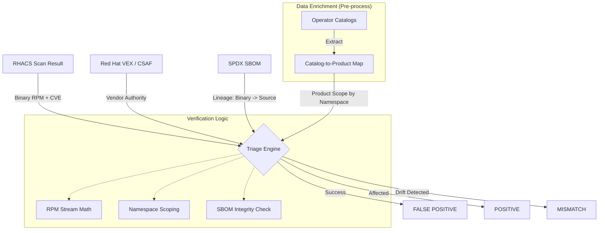

# Technical Explainer: Automated VEX Triage and Verification

This document summarizes how our framework automates the validation of security findings from Red Hat Advanced Cluster Security (RHACS) using authoritative vendor data.

---

## 1. The Core Workflow: High-Integrity Triage

The system automates the "Decision Tree" for every CVE by cross-referencing three sources of truth. 

---

## 2. Key Technical Pillars

### Precision Scoping: The Catalog-to-Namespace Map
One of the most difficult challenges in triage is knowing which VEX Product Name (e.g., advanced_cluster_management) applies to a specific image found in a registry namespace (e.g., rhacm2). Without a map, the engine would not know which advisories are relevant.

*   **Rationale:** Registry namespaces and VEX product names often do not match. An image in rhacm2/multicluster-operators must be checked against Advanced Cluster Management advisories, not just RHEL base OS advisories.
*   **Data Acquisition:** Instead of manual lists, the engine uses build_ns_map.py to harvest metadata directly from Red Hat OLM Operator Catalogs. It extracts:
    1.  The Registry Namespace where the images live.
    2.  The OLM Package Name (the technical identifier).
    3.  The Display Name (the human-readable product name).
*   **Accuracy:** Because this data is extracted from the same catalogs used to install the operators, it reflects the ground truth of how products are grouped. By normalizing these names into VEX-compatible prefixes, the engine dynamically scopes its search to the exact product family the image belongs to.

### The Bridge: Binary-to-Source Mapping
Scanners report Binary packages (e.g., python3-urllib3), but advisories are often published against the Source package (e.g., python-urllib3). 
*   **Implementation:** The engine extracts the GENERATED_FROM relationship from the SPDX SBOM. This automatically maps binary findings to the correct source-level security advisories.

### Stream-Aware Auditing (RPM Math)
Red Hat fixes bugs in older versions (Backporting) without changing the major version number.
*   **Implementation:** The engine identifies the RHEL Minor Stream (e.g., 9.2 vs 9.4) and Module Streams (+module+). It ensures a package is only cleared if the fix was released for its specific version stream.

### The Sanity Check: SBOM Verification
To prevent relying on stale scanner data, the engine performs a final check:
*   **Implementation:** Every package and version that leads to a FALSE POSITIVE verdict is cross-referenced against the physical contents of the image SBOM. If they do not match, the finding is flagged for manual review.

---

## 3. Summary of Verdicts

| Verdict | Meaning |
| :--- | :--- |
| **FALSE POSITIVE** | Vendor confirms code is not affected, OR the installed version is greater than or equal to the fix for that specific minor stream. |
| **POSITIVE** | Confirmed affected; version is older than the fix in that stream. |
| **MISMATCH** | The scanner data differs from the physical SBOM. Manual verification is required. |
