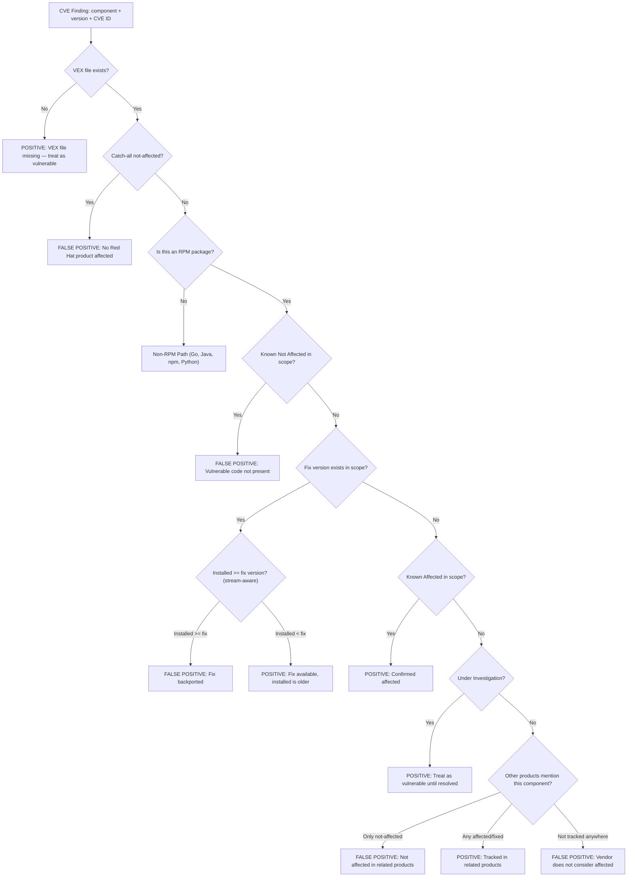

# Technical Explainer: Automated VEX Triage and False Positive Detection

This document explains the complete system — from setup through scanning to per-CVE verdict — used by the triage engine to validate security findings from Red Hat Advanced Cluster Security (RHACS). It covers **why** each stage exists, how every CVE finding is evaluated, how false positives are identified, and what safeguards prevent incorrect verdicts.

---

## 1. The Setup Pipeline: End-to-End Stages

Before any CVE is triaged, `setup_and_scan.py` orchestrates a six-stage pipeline that prepares the data the triage engine needs. Each stage solves a specific problem.

### Stage 0 — Registry Authentication (`podman login`)

**What:** Log in to `registry.redhat.io`, `quay.io`, and `registry.connect.redhat.com` using the user's pull-secret.

**Why:** Every subsequent stage pulls container images or metadata from authenticated Red Hat registries. Without valid credentials, `opm render` (Stage 1) and `oc adm release info` (Stage 3) fail silently or return partial data. Authenticating once up front avoids scattered auth failures later.

### Stage 1 — Render Operator Index Catalogs (`opm render`)

**What:** For each unique OCP minor version (e.g., 4.20, 4.21), run `opm render` against the Red Hat operator index image (`registry.redhat.io/redhat/redhat-operator-index:v4.21`) and save the output as `data/catalogs/catalog-4.21.json`.

**Why this exists:** The operator catalog is the only machine-readable source that links a container image's registry namespace to its Red Hat product identity. This link is essential for VEX matching (explained in Section 2). The catalog is rendered per minor version because the operator landscape changes between OCP releases — new operators appear, channels move, and display names drift. A single static catalog would go stale within one release cycle.

**Why `opm` specifically:** The File-Based Catalog (FBC) format used by OLM is a series of concatenated JSON objects — not a standard API response. `opm render` is the official tool for extracting this data from the operator index image. There is no REST endpoint or package manager query that provides the same information.

### Stage 2 — Build the Namespace-to-VEX Prefix Map (`build_ns_map.py`)

**What:** Parse every `catalog-*.json` file from Stage 1, extract three identifiers per operator bundle (registry namespace, OLM package name, and operator display name), normalise them to snake_case, and write the result to `data/ns_vex_prefixes.json`.

**Why this exists — the naming mismatch problem:** This is the bridge between the container registry world and the VEX/CSAF world. Red Hat VEX advisories identify products using names like `red_hat_advanced_cluster_management_for_kubernetes_2`, while the container images for that same product live under the registry namespace `rhacm2/`. There is zero string overlap. Without the catalog-derived map, the engine would have no way to know that an image pulled from `registry.redhat.io/rhacm2/multicluster-engine-rhel8-operator` should be matched against VEX entries for "Advanced Cluster Management."

The map is generated — not hardcoded — because Red Hat ships approximately 150+ operators, their names evolve across releases, and maintaining a manual table would break within weeks of a new OCP version.

See Section 2 for the full explanation of how this map is used at triage time.

### Stage 3 — Fetch OCP Release Pullspecs (`oc adm release info`)

**What:** For each full OCP version (e.g., 4.21.3), query the release image at `quay.io/openshift-release-dev/ocp-release:4.21.3-x86_64` and write the full list of component image pullspecs (with SHA256 digests) to `4.21.3.txt`.

**Why:** An OCP release is a curated set of ~150+ container images (etcd, kube-apiserver, oauth-proxy, console, etc.). The release image is the only authoritative source for which exact image builds ship in a given OCP version. The output file becomes the input for Stage 4 — each line is a pinned image reference that the triage engine scans individually.

### Stage 4 — Triage OCP Releases

**What:** For each pullspec file from Stage 3, run `triage.py --ocp <file>`, which scans every image in the release through RHACS and evaluates all CVE findings against Red Hat VEX data. Results are saved to `data/reports/ocp-4.21.3.csv`.

**Why split from operators:** OCP platform images and operator images have different product scopes in VEX. A CVE fix released for "Red Hat OpenShift Container Platform 4.18" does not clear the same package in OCP 4.21. The engine must know the exact OCP version to scope VEX matching correctly.

### Stage 5 — Triage Operators

**What:** For each OCP minor version, parse the catalog from Stage 1 to find all operator packages, identify the head bundle of each operator's default channel, retrieve the bundle's `relatedImages`, and triage every image. Results are saved per-operator: `data/reports/ocp-4.21/{operator}-{channel}-{bundle_version}.csv`.

**Why per-minor, not per-patch:** Operators are versioned by their OLM channel, not by OCP patch releases. The same operator bundle (and therefore the same images) ships across all patch versions of a given OCP minor. Stage 5a exploits this by pre-copying identical reports across minor versions to avoid redundant scans.

---

## 2. Why Catalog-Derived Namespace Mapping Exists

### The problem

When a scanner reports a CVE in a container image, the triage engine must determine: **which Red Hat product does this image belong to?** The answer controls which VEX entries are considered relevant.

For OCP platform images, the answer is straightforward — images from `openshift4/` or `ocp4/` namespaces belong to "Red Hat OpenShift Container Platform." For UBI images, they belong to "Red Hat Enterprise Linux."

For operators, there is no such obvious mapping. Consider:

| Image registry path | VEX product name |
| :--- | :--- |
| `rhacm2/multicluster-engine-rhel8-operator` | `red_hat_advanced_cluster_management_for_kubernetes_2` |
| `odf4/mcg-core-rhel9` | `red_hat_openshift_data_foundation_4` |
| `openshift-gitops-1/gitops-rhel8` | `red_hat_openshift_gitops` |
| `compliance/openshift-compliance-rhel8-operator` | `compliance_operator` |

There is no algorithmic transformation from the left column to the right. The registry namespace (`rhacm2`) is an abbreviation chosen by the engineering team. The VEX product name is the official product name chosen by Red Hat Product Security. They evolved independently.

### The solution

The OLM operator catalog is the Rosetta Stone. Every `olm.bundle` entry in the catalog carries three pieces of information:

1. **`image`** — the full registry URL, which gives us the namespace (e.g., `rhacm2`)
2. **`package`** — the OLM package name (e.g., `advanced-cluster-management`)
3. **`properties[olm.csv.metadata].displayName`** — the human-readable name (e.g., "Red Hat Advanced Cluster Management for Kubernetes")

`build_ns_map.py` normalises all three to snake_case (stripping common prefixes like "Red Hat OpenShift" to produce shorter candidates) and groups them by namespace. The result is a JSON map like:

```json
{
  "rhacm2": [
    "advanced_cluster_management",
    "advanced_cluster_management_for_kubernetes",
    "multicluster_engine",
    ...
  ]
}
```

At triage time, when the engine encounters an image from `rhacm2/`, it loads these prefixes and checks whether any VEX product ID contains one of them. This substring match is deliberately fuzzy — Red Hat may name their VEX product `red_hat_advanced_cluster_management_for_kubernetes_2` or `advanced_cluster_management_2.10`, and the prefix `advanced_cluster_management` matches both.

### Why not hardcode it?

Red Hat ships 150+ operators. Their marketing names change, new operators appear every OCP release, and some operators move between product families (e.g., when a component is promoted from Tech Preview to GA under a different name). A hardcoded table would require manual updates after every OCP release. The catalog-derived map rebuilds itself automatically from the source of truth.

---

## 3. Why Image Labels Matter

### The problem

A container image reference like `registry.redhat.io/rhacm2/multicluster-engine-rhel8-operator@sha256:abc123...` encodes some context in the path — but not enough for accurate triage.

What the image reference **does** tell you:
- Registry namespace: `rhacm2` (used for operator product mapping)
- The string `rhel8` appears in the name (suggests RHEL 8)

What the image reference **does not** tell you:
- The exact RHEL minor version (is it el8_4 or el8_10?)
- The product version (is this ACM 2.9 or 2.10?)
- The canonical image path when pulled through a mirror (the registry hostname may differ)

### Where labels fill the gap

Every Red Hat container image embeds Docker labels at build time. Two are critical:

**The `name` label** (e.g., `rhacm2/multicluster-operators-subscription-rhel9`):
This is the canonical image path — it survives registry mirrors. When an image is pulled from `registry.access.redhat.com` instead of `registry.redhat.io`, the path may differ, but the `name` label always contains the canonical form. The engine uses this label as the primary input for namespace resolution, falling back to the image reference URL only when the label is absent.

**The `cpe` label** (e.g., `cpe:/a:redhat:acm:2.10::el9`):
CPE (Common Platform Enumeration) is a structured identifier that encodes the product and platform. The engine parses it to extract:

1. **RHEL major version** — from the language field (`el9` → RHEL 9). This is critical because VEX entries are scoped per RHEL major version. A fix for a package on RHEL 8 does not clear the same package on RHEL 9.

2. **Product version** — from the version field (`2.10` for ACM). This refines the display name and, for OCP images, controls which VEX product entries match (VEX "4.18" does not match OCP 4.21).

### What happens without labels

If no labels are available, the engine falls back to parsing the image reference URL alone. This means:
- RHEL version defaults to "8" (may be wrong for RHEL 9 images that don't have `rhel9` in their name)
- Product version is unknown (display name shows "4.x" for OCP)
- Mirror-swapped URLs may fail namespace resolution

Labels turn an educated guess into a precise classification.

---

## 4. Data Sources

The engine cross-references five sources of truth for every finding:

The engine cross-references five sources of truth for every finding:

| Source | What it provides | Origin |
| :--- | :--- | :--- |
| **RHACS Scan Result** | Binary RPM name, version, CVE ID, scanner severity | RHACS API (`/v1/images/scan`) |
| **Red Hat VEX/CSAF** | Authoritative vendor status per CVE per product | `security.access.redhat.com/data/csaf/v2/vex/` |
| **SPDX 2.3 SBOM** | Binary-to-source RPM lineage, package inventory | RHACS API (`/api/v1/images/sbom`) |
| **Namespace-to-VEX Map** | Product scope for operators (catalog-derived) | OLM operator catalogs via `build_ns_map.py` |
| **RPM Version Database** | Epoch-aware RPM version comparison | `version_utils.rpm` library |

Each VEX file is a CSAF 2.0 document published by Red Hat Product Security. It contains a **product tree** (which products exist) and **vulnerability entries** (which products are affected, fixed, not affected, or under investigation for that CVE).

---

## 5. Workload Classification and Scope

Before any CVE is evaluated, the engine determines **what kind of workload** the container image belongs to. This controls which VEX product entries are considered relevant ("in scope").

### How workload type is detected

The engine parses the image reference URL and Docker labels to classify the image into one of three types:

- **UBI (Universal Base Image)**: Images from `ubi8/`, `ubi9/`, or `rhel/` namespaces. These are standalone RHEL-based images.
- **OCP (OpenShift Container Platform)**: Images from `openshift4/`, `ocp4/` namespaces, or images containing `ose-` in their name. The OCP version is extracted from the image tag (e.g., `v4.21`).
- **Operator**: Everything else. The engine resolves the image's registry namespace against the catalog-derived namespace-to-VEX map to determine which Red Hat product family the image belongs to.

### Scope rules per workload type

| Workload | Which VEX product entries are in scope |
| :--- | :--- |
| **UBI** | Only RHEL base repository products (BaseOS, AppStream, CRB, SAP, etc.) — identified dynamically from the VEX product tree by name prefix "Red Hat Enterprise Linux". No hardcoded stream names. |
| **OCP** | RHEL base repos **plus** any product whose VEX name matches "Red Hat OpenShift Container Platform" with version-prefix matching (VEX "4" covers any 4.x; VEX "4.21" covers 4.21.x only). |
| **Operator** | RHEL base repos **plus** all prefix candidates from the catalog-derived map. For example, an image in `rhacm2/` maps to prefixes like `advanced_cluster_management`, `multicluster_engine`, etc. |

This scoping is critical: a CVE fix released only for OpenShift 4.18 does not clear the same package when it ships in OpenShift 4.21. The engine enforces this through component-wise version-prefix matching.

---

## 6. The Bridge: Binary-to-Source RPM Mapping

Scanners report **binary RPM names** (e.g., `python3-urllib3`, `openssl-libs`, `libgcc`), but VEX advisories reference the **source RPM** (e.g., `python-urllib3`, `openssl`, `gcc`). Without bridging this gap, the engine would fail to match valid advisories.

The engine extracts `GENERATED_FROM` relationships from the SPDX 2.3 SBOM. These relationships link every binary RPM to the source RPM it was built from. The result is a mapping like:

- `python3-urllib3` maps to `python-urllib3`
- `openssl-libs` maps to `openssl`
- `libgcc` maps to `gcc`
- `platform-python` maps to `python3`

When matching a component against VEX product IDs, the engine tries **both** the binary name and the source name. This means a VEX entry for source package `python-urllib3` will correctly match a scanner finding reported as `python3-urllib3`.

---

## 7. The Decision Tree: How Every CVE is Evaluated

For each CVE finding (component + version + CVE ID), the engine runs a sequential decision tree. The order matters — earlier checks take precedence. The engine stops at the first match and returns that verdict.


```mermaid
graph TD
    START[CVE Finding: component + version + CVE ID] --> VEX_LOAD{VEX file exists?}
    VEX_LOAD -->|No| P1["POSITIVE: VEX file missing — treat as vulnerable"]
    VEX_LOAD -->|Yes| CATCHALL{Catch-all not-affected?}
    
    CATCHALL -->|Yes| FP1["FALSE POSITIVE: No Red Hat product affected"]
    CATCHALL -->|No| RPM{Is this an RPM package?}
    
    RPM -->|No| NON_RPM["Non-RPM Path (Go, Java, npm, Python)"]
    RPM -->|Yes| KNA{Known Not Affected in scope?}
    
    KNA -->|Yes| FP2["FALSE POSITIVE: Vulnerable code not present"]
    KNA -->|No| FIXED{Fix version exists in scope?}
    
    FIXED -->|Yes| COMPARE{"Installed >= fix version? (stream-aware)"}
    FIXED -->|No| KA{Known Affected in scope?}
    
    COMPARE -->|Installed >= fix| FP3["FALSE POSITIVE: Fix backported"]
    COMPARE -->|Installed < fix| P2["POSITIVE: Fix available, installed is older"]
    
    KA -->|Yes| P3["POSITIVE: Confirmed affected"]
    KA -->|No| UI{Under Investigation?}
    
    UI -->|Yes| P4["POSITIVE: Treat as vulnerable until resolved"]
    UI -->|No| OTHER{Other products mention this component?}
    
    OTHER -->|Only not-affected| FP4["FALSE POSITIVE: Not affected in related products"]
    OTHER -->|Any affected/fixed| P5["POSITIVE: Tracked in related products"]
    OTHER -->|Not tracked anywhere| FP5["FALSE POSITIVE: Vendor does not consider affected"]
```

---

## 8. False Positive Detection: The Six RPM Checks

Each check below is applied in order. Every check includes guards that prevent incorrect matches.

### Check 1: Catch-All Not-Affected

**What it checks:** Whether Red Hat has explicitly stated that **no currently supported Red Hat product** is affected by this CVE.

**How it works:** The VEX product tree contains a top-level vendor node (product ID `red_hat_products`) with a CPE like `cpe:/a:redhat`. If this vendor-level product ID appears in the `known_not_affected` list or is flagged with a not-affected label, the entire CVE is a false positive regardless of which component or image is being scanned.

**Verdict:** FALSE POSITIVE — "Red Hat Product Security states no currently supported Red Hat product is affected by this CVE."

**Why this is safe:** This is the vendor's authoritative statement at the broadest possible scope. If Red Hat says none of their products are affected, no individual RHEL-based package can be affected.

---

### Check 2: Known Not Affected (In Scope)

**What it checks:** Whether the specific component, in the specific product that this image belongs to, is explicitly listed as not affected.

**How it works:** The engine looks at the `known_not_affected` product status and not-affected flags in the VEX document. For each product ID listed:

1. **Scope check**: Is this product ID relevant to the current workload? (UBI/OCP/operator rules apply.)
2. **Module stream guard**: If the VEX entry targets a module stream package (indicated by `::module:stream` suffix in the product ID), skip it unless the installed package is also a module stream package (indicated by `+module+` in its version string). And vice versa: a module-stream fix does not apply to the base package.
3. **Package name match**: The package name extracted from the VEX product ID must match either the binary RPM name or the source RPM name (via the SBOM-derived mapping).
4. **Minor stream guard**: If the installed package carries a RHEL minor stream marker (e.g., `el8_10`), the "known not affected" entry must come from the same minor stream. A KNA from `el8_4` does not clear a package built for `el8_10` — the backport status may differ between streams.

**Verdict:** FALSE POSITIVE — "Component known not affected (vulnerable code not present or not executable)."

**Why this is safe:** Red Hat has determined that the vulnerable code path is either absent from the compiled binary, unreachable at runtime, or otherwise not exploitable in this product context.

---

### Check 3: Fixed Version Comparison (Stream-Aware)

**What it checks:** Whether the installed version is equal to or newer than the fix version that Red Hat has released for this component in this product.

**How it works:** This is the most complex check, because naive version comparison across RHEL streams produces false positives. The engine uses a stream-aware comparison strategy:

**Step 1: Collect fix versions.** From the VEX `fixed` product status, gather all fix versions where the product ID is in scope, the module stream guard passes, and the package name matches.

**Step 2: Detect the installed package's minor stream.** Parse the version string for a RHEL minor stream marker. For example:
- `3.9.18-3.el9_4.10` belongs to the **RHEL 9.4** stream (minor = "4")
- `2.4.37-64.module+el8.10.0+22310` belongs to the **RHEL 8.10** stream (minor = "10")
- `3.6.8-59.el8` has **no minor stream** — it is a GA (general availability) package

**Step 3: Filter fixes by stream.** If the installed package has a minor stream marker, only compare against fix versions from the **same minor stream**. If fixes exist but only for other streams, the verdict is POSITIVE with the message "fix not yet released in this stream."

**Step 4: Compare versions.** Using RPM-aware comparison with proper epoch handling:
- If the installed version is **greater than or equal to** the fix version: FALSE POSITIVE — "Fix backported: installed X >= Y"
- If the installed version is **less than** the fix version: POSITIVE — "Fix available; installed version is older"

For GA packages (no minor stream marker), the installed version must be greater than or equal to **all** fix versions across streams, because a newer-stream fix proves the GA baseline is still vulnerable.

#### Why stream isolation matters: a concrete example

Consider CVE-2024-XXXX affecting `python3` on RHEL 9. Red Hat backports the fix to multiple EUS (Extended Update Support) streams:

- RHEL 9.0 fix: `3.9.10-4.el9_0.9`
- RHEL 9.4 fix: `3.9.18-3.el9_4.11`

A system running RHEL 9.4 has `python3` version `3.9.18-3.el9_4.10` installed. Without stream isolation, the engine would compare `3.9.18-3.el9_4.10` against `3.9.10-4.el9_0.9` and conclude the installed version is newer — a **false positive**, because the RHEL 9.0 fix is a completely different version track. The correct comparison is against `3.9.18-3.el9_4.11` (same stream), which reveals that the installed version is **older** — a genuine positive.

#### Epoch handling

RPM versions can include an epoch prefix (e.g., `4:5.26.3-422.el8`). A higher epoch always wins regardless of the version-release string. When comparing, the engine normalises epochs: if one version string has an epoch and the other does not (common in VEX fixed versions), the engine propagates the present epoch to the string that lacks it, since both describe the same source package.

---

### Check 4: Known Affected (In Scope)

**What it checks:** Whether Red Hat has confirmed that the component **is** affected in this product and either a fix is pending, not planned, or only available for a different product.

**How it works:** The engine checks the `known_affected` product status with the same scope, module stream, and package name guards. It then examines remediations:

- **No fix planned**: If the product ID appears in a `no_fix_planned` remediation, the verdict is POSITIVE with: "Red Hat will not fix this CVE — not actionable." This tells the operator the vulnerability exists but the vendor has decided not to release a patch.
- **Fix exists in another product**: If a fix exists in the VEX `fixed` list but under a different product ID (one that is not in scope for this workload), the verdict is POSITIVE with context: "Fix exists only in [other product] — fix not applicable to this workload."
- **No fix available**: POSITIVE with: "Confirmed affected; no fix available yet."

---

### Check 5: Under Investigation

**What it checks:** Whether Red Hat is still analyzing whether this component is affected in this product.

**How it works:** If an in-scope product ID appears in the `under_investigation` product status (with module stream and package name guards passing), the verdict is POSITIVE: "Under investigation by Red Hat — treat as vulnerable until resolved."

**Rationale:** Until Red Hat completes its analysis, the conservative approach is to treat the finding as a genuine vulnerability. The vendor may later move it to "not affected" or "fixed."

---

### Check 6: Fallback — Cross-Product Inference

**What it checks:** When no in-scope VEX entry exists for this component, do **other Red Hat products** mention it?

**How it works:** The engine scans the VEX `fixed`, `known_affected`, and `known_not_affected` lists for the same package name under product IDs that match the same RHEL major version but are not in scope for this workload.

Three outcomes:

- **Only not-affected entries exist**: FALSE POSITIVE — "Red Hat states component not affected in related products; not tracked as affected for this workload." If no RHEL product considers the package affected, it is safe to infer the same for this workload.
- **Any affected or fixed entries exist**: POSITIVE — "CVE tracked in related products; no explicit clearance for this workload — treat as vulnerable." The existence of a fix or affected status in a related product signals genuine risk.
- **Not tracked anywhere in VEX**: NOT ASSESSED — "Component not tracked in VEX for this CVE — no vendor assessment exists." Absence from VEX does not confirm the component is safe. The finding should be treated as a potential risk until explicitly cleared by the vendor.

---

## 9. Non-RPM Path: Go, Java, npm, Python

Non-RPM components follow a different logic path because their version strings are not RPM-formatted and cannot be reliably compared using RPM version math.

### Why version comparison fails for non-RPM

Go binaries, Java JARs, npm packages, and Python wheels use their own versioning schemes. The version string reported by the scanner may not correspond to the version string in the VEX advisory. Red Hat often ships patched versions of these components under a version string that includes RPM-style release suffixes, making direct comparison meaningless.

### How non-RPM false positives are detected

The engine uses four progressively broader checks:

**1. Not tracked in VEX at all.** If the VEX document contains no product entries for any Red Hat product mentioning this component — no affected, fixed, not affected, or investigating entries — the verdict is NOT ASSESSED. Red Hat's VEX coverage for non-RPM components (Go modules, Java JARs, npm packages) is not comprehensive — absence from VEX does not mean the component is safe, only that no vendor assessment exists. The finding should be treated as a potential risk until explicitly cleared.

**2. SHA256 image-digest matching.** For container image components (identified by `/` in the component name), the engine checks for VEX product IDs that contain the exact SHA256 digest of the image being scanned. This provides **build-level precision**:
- If the exact image digest is listed as `known_not_affected`: FALSE POSITIVE — "Image build not affected per VEX."
- If the exact image digest is listed as `fixed`: FALSE POSITIVE — "This image build is the fixed version."
- If the exact image digest is listed as `known_affected`: POSITIVE — "Image build confirmed affected."
- If a fixed digest exists but does not match the installed digest: POSITIVE — "Fixed image build exists but installed version is older."

**3. Product-level flags.** The engine checks not-affected flags scoped to the workload's product family. These flags use VEX `flag` entries (label: `vulnerable_code_not_present` or similar) applied to specific product IDs. If a flag matches the workload scope and the package name, the verdict is FALSE POSITIVE.

**4. Generic product status scan.** The engine checks `known_not_affected`, `known_affected`, `fixed`, and `under_investigation` entries for any in-scope product ID where the package name matches, applying SHA256 verification for image-level PIDs.

**5. Cross-product inference.** Same logic as the RPM fallback: if only not-affected entries exist in related products, FALSE POSITIVE. If any affected/fixed entries exist, POSITIVE.

---

## 10. Module Stream Guard

RHEL 8 and 9 support parallel package versions through **module streams** (e.g., `perl:5.26` vs `perl:5.32`, `nodejs:18` vs `nodejs:20`). A fix for `perl:5.26` does not apply to `perl:5.32` — they are different version tracks maintained independently.

### How module streams are detected

- **In VEX product IDs**: Module streams appear as a `::module:stream` suffix (e.g., `AppStream-8.x:perl-0:5.26.3-422.el8.x86_64::perl:5.26`).
- **In installed packages**: Module stream RPMs contain `+module+` or `.module+` in their version-release string (e.g., `5.26.3-422.module+el8.6.0+20569`).

### The guard rule

- If the VEX product ID has a module stream suffix but the installed package is **not** a module stream RPM: **skip this VEX entry** — it is for a different version track.
- If the VEX product ID has no module stream suffix but the installed package **is** a module stream RPM: the VEX entry still applies (base advisories cover all streams unless overridden).

This guard is applied at every check in the decision tree: known not affected, fixed version comparison, known affected, under investigation, and cross-product fallback.

---

## 11. Severity Determination

The engine extracts the severity rating from VEX rather than relying solely on the scanner's CVSS score. Four sources are checked in priority order:

1. **Threat impact field**: The `threats` array in the VEX vulnerability entry, filtered for `category: "impact"`. This is Red Hat's explicit severity assessment (Critical, Important, Moderate, Low).
2. **Aggregate severity**: The document-level `aggregate_severity` field in the CSAF header.
3. **CVSS base severity**: Extracted from the `scores` array (CVSS v3 preferred, v2 as fallback), mapped to Red Hat equivalents: HIGH becomes Important, MEDIUM becomes Moderate.
4. **RHACS scanner severity**: As a final fallback, the engine uses the severity from the scan result, stripping the `_VULNERABILITY_SEVERITY` suffix.

### Severity mismatch detection

After triage, the engine compares the scanner's severity with the VEX-derived severity. When they differ, the finding is flagged with a severity mismatch indicator. This alerts operators when the scanner reports a different risk level than the vendor's own assessment — common when CVSS scores diverge from Red Hat's product-specific impact analysis.

---

## 12. SBOM Verification: The Sanity Check

After all findings are triaged, the engine performs a final verification step to catch stale scanner data.

**How it works:** Every component name and version that appeared in the triage results is cross-referenced against the actual packages in the SPDX 2.3 SBOM. The engine compares:

- Does the component exist in the SBOM?
- Does the version match (with epoch stripping for comparison)?

**Outcomes:**
- **All match**: "SBOM verified: X/Y component versions confirmed in image" — the scanner data is consistent with the actual image contents.
- **Mismatches found**: Each mismatched component is flagged with what the SBOM actually contains. This catches cases where the scanner has cached an older scan result that no longer reflects the current image build.

This step prevents the engine from issuing false positive verdicts based on outdated version information.

---

## 13. The Per-Image Pipeline

Once the setup pipeline (Section 1) has prepared catalogs, namespace maps, and pullspec lists, each individual image processed by Stages 4 and 5 goes through this per-image flow:

1. **Fetch scan data** from RHACS (with 4-hour cache TTL).
2. **Parse image reference** to determine workload type (UBI/OCP/operator), RHEL version, OCP version, and product scope.
3. **Refine context** from Docker labels: extract RHEL version from CPE language field, product name from labels.
4. **Fetch SBOM** from RHACS (with 7-day cache TTL) and build binary-to-source RPM name mapping.
5. **Download VEX files** for all unique CVEs in the scan results (with ETag-based caching).
6. **Run the decision tree** for each CVE finding (component + version + CVE ID).
7. **Detect severity mismatches** between scanner and VEX severity ratings.
8. **Verify against SBOM** to catch stale scanner data.
9. **Produce verdicts**: FALSE POSITIVE, POSITIVE, or flagged MISMATCH.

---

## 14. Summary of Verdicts

| Verdict | Meaning | When it occurs |
| :--- | :--- | :--- |
| **FALSE POSITIVE** | Vendor confirms code is not affected, OR the installed version includes the fix for the correct stream. | Catch-all not-affected, known not affected, fix backported, or cross-product inference (only not-affected entries in related products). |
| **POSITIVE** | Confirmed affected; fix is pending, not yet released for this stream, or installed version is older than the fix. | Known affected, under investigation, fix available but not installed, or related products track it as affected. |
| **NOT ASSESSED** | No vendor assessment exists for this component in this CVE. Absence from VEX does not confirm safe — treat as potential risk until explicitly cleared. | Component not tracked anywhere in VEX (neither RPM nor non-RPM). Conservative teams should treat these as POSITIVE. |
| **MISMATCH** | The scanner data differs from the physical SBOM contents. | SBOM verification step detects version discrepancy. Manual verification required. |

---

## 15. Key Design Invariants

The engine avoids hardcoding wherever possible to remain accurate as Red Hat's product landscape evolves:

- **No hardcoded VEX product names**: All product identification is derived from the CSAF product tree at runtime.
- **No hardcoded RHEL stream names**: Base repo products are identified by matching VEX product names starting with "Red Hat Enterprise Linux".
- **No hardcoded package mappings**: All binary-to-source RPM mappings come from the SBOM's `GENERATED_FROM` relationships.
- **No hardcoded operator product scopes**: Operator-to-product mapping is catalog-derived from OLM bundle metadata.
- **Module stream detection uses only the version string**: The `+module+` marker in the RPM release field is the sole signal.
- **SBOM is the source of truth**: The physical image contents (via SBOM) are used to verify scanner data, not the other way around.
