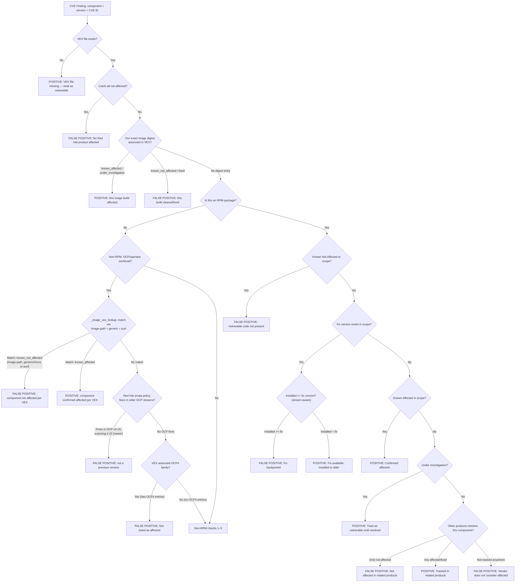

# Technical Explainer: Automated VEX Triage and False Positive Detection

This document explains the complete system — from setup through scanning to per-CVE verdict — used by the triage engine to validate security findings from Red Hat Advanced Cluster Security (RHACS). It covers **why** each stage exists, how every CVE finding is evaluated, how false positives are identified, and what safeguards prevent incorrect verdicts.

---

## 1. The Setup Pipeline: End-to-End Stages

Before any CVE is triaged, `setup_and_scan.py` orchestrates a six-stage pipeline that prepares the data the triage engine needs. Each stage solves a specific problem.

### Stage 0 — Registry Authentication (`podman login`)

**What:** Log in to `registry.redhat.io`, `quay.io`, and `registry.connect.redhat.com` using the user's pull-secret.

**Why:** Every subsequent stage pulls container images or metadata from authenticated Red Hat registries. Without valid credentials, `opm render` (Stage 1) and `oc adm release info` (Stage 3) fail silently or return partial data. Authenticating once up front avoids scattered auth failures later.

### Stage 1 — Render Operator Index Catalogs (`opm render`)

**What:** For each unique OCP minor version (e.g., 4.20, 4.21), run `opm render` against the Red Hat operator index image (`registry.redhat.io/redhat/redhat-operator-index:v4.21`) and save the output as `data/catalogs/catalog-4.21.json`.

**Why this exists:** The operator catalog is the only machine-readable source that links a container image's registry namespace to its Red Hat product identity. This link is essential for VEX matching (explained in Section 2). The catalog is rendered per minor version because the operator landscape changes between OCP releases — new operators appear, channels move, and display names drift. A single static catalog would go stale within one release cycle.

**Why `opm` specifically:** The File-Based Catalog (FBC) format used by OLM is a series of concatenated JSON objects — not a standard API response. `opm render` is the official tool for extracting this data from the operator index image. There is no REST endpoint or package manager query that provides the same information.

### Stage 2 — Build the Namespace-to-VEX Prefix Map (`build_ns_map.py`)

**What:** Parse every `catalog-*.json` file from Stage 1, extract identifiers per operator bundle (registry namespace, OLM package name, and operator display name), plus the namespaces of all `relatedImages`. Normalise them to snake_case and write the result to `data/ns_vex_prefixes.json`. The `relatedImages` step is critical because workload images often live in a different registry namespace than the bundle (e.g., ACS bundles are in `advanced-cluster-security/` but workload images are in `rh-acs/`).

**Why this exists — the naming mismatch problem:** This is the bridge between the container registry world and the VEX/CSAF world. Red Hat VEX advisories identify products using names like `red_hat_advanced_cluster_management_for_kubernetes_2`, while the container images for that same product live under the registry namespace `rhacm2/`. There is zero string overlap. Without the catalog-derived map, the engine would have no way to know that an image pulled from `registry.redhat.io/rhacm2/multicluster-engine-rhel8-operator` should be matched against VEX entries for "Advanced Cluster Management."

The map is generated — not hardcoded — because Red Hat ships approximately 150+ operators, their names evolve across releases, and maintaining a manual table would break within weeks of a new OCP version.

See Section 2 for the full explanation of how this map is used at triage time.

### Stage 3 — Fetch OCP Release Pullspecs (`oc adm release info`)

**What:** For each full OCP version (e.g., 4.21.3), query the release image at `quay.io/openshift-release-dev/ocp-release:4.21.3-x86_64` and write the full list of component image pullspecs (with SHA256 digests) to `4.21.3.txt`.

**Why:** An OCP release is a curated set of ~150+ container images (etcd, kube-apiserver, oauth-proxy, console, etc.). The release image is the only authoritative source for which exact image builds ship in a given OCP version. The output file becomes the input for Stage 4 — each line is a pinned image reference that the triage engine scans individually.

### Stage 4 — Triage OCP Releases

**What:** For each pullspec file from Stage 3, run `triage.py --ocp <file>`, which scans every image in the release through RHACS and evaluates all CVE findings against Red Hat VEX data. Results are saved to `data/reports/ocp-4.21.3.csv`.

**Why split from operators:** OCP platform images and operator images have different product scopes in VEX. A CVE fix released for "Red Hat OpenShift Container Platform 4.18" does not clear the same package in OCP 4.21. The engine must know the exact OCP version to scope VEX matching correctly.

### Stage 5 — Triage Operators

**What:** Parse all OCP catalogs, collect every unique workload image across all operators/channels/versions, batch-scan them once via RHACS, then assemble per-operator CSV reports from cached results. Results are saved per-operator: `data/reports/ocp-4.21/{operator}-{channel}-{bundle_version}.csv`.

The scan runs in three phases:
1. **Catalog analysis** — parse all catalogs, deduplicate images across operators/channels/versions
2. **Batch scan** — scan each unique image SHA exactly once via RHACS (parallel workers, progress with ETA)
3. **Report assembly** — build per-operator CSVs from cached scan results (no RHACS calls)

**Why image-level dedup:** The same image often appears in multiple operators or across OCP minor versions. Without dedup, ~63% of RHACS scans are redundant. Stage 5a additionally pre-copies identical report files across minor versions when the bundle version matches.

---

## 2. Why Catalog-Derived Namespace Mapping Exists

### The problem

When a scanner reports a CVE in a container image, the triage engine must determine: **which Red Hat product does this image belong to?** The answer controls which VEX entries are considered relevant.

For OCP platform images, the answer is straightforward — images from `openshift4/` or `ocp4/` namespaces belong to "Red Hat OpenShift Container Platform." For UBI images, they belong to "Red Hat Enterprise Linux."

For operators, there is no such obvious mapping. Consider:

| Image registry path | VEX product name |
| :--- | :--- |
| `rhacm2/multicluster-engine-rhel8-operator` | `red_hat_advanced_cluster_management_for_kubernetes_2` |
| `odf4/mcg-core-rhel9` | `red_hat_openshift_data_foundation_4` |
| `openshift-gitops-1/gitops-rhel8` | `red_hat_openshift_gitops` |
| `compliance/openshift-compliance-rhel8-operator` | `compliance_operator` |

There is no algorithmic transformation from the left column to the right. The registry namespace (`rhacm2`) is an abbreviation chosen by the engineering team. The VEX product name is the official product name chosen by Red Hat Product Security. They evolved independently.

### The solution

The OLM operator catalog is the Rosetta Stone. Every `olm.bundle` entry in the catalog carries three pieces of information:

1. **`image`** — the full registry URL, which gives us the bundle namespace (e.g., `advanced-cluster-security`)
2. **`package`** — the OLM package name (e.g., `rhacs-operator`)
3. **`properties[olm.csv.metadata].displayName`** — the human-readable name (e.g., "Advanced Cluster Security for Kubernetes")

Additionally, each bundle lists its **`relatedImages`** — the actual workload images that get deployed. These often live in a different registry namespace than the bundle itself (e.g., ACS workload images are in `rh-acs/`, not `advanced-cluster-security/`).

`build_ns_map.py` normalises the package name and display name to snake_case (stripping common prefixes like "Red Hat OpenShift" to produce shorter candidates) and attaches these prefixes to **every namespace** the bundle touches — both the bundle image namespace and all `relatedImages` namespaces. Shared base namespaces (`ubi8`, `ubi9`, `ubi10`, `rhel7`–`rhel10`, `openshift4`, etc.) are excluded to prevent prefix pollution. The result is a JSON map like:

```json
{
  "advanced-cluster-security": [
    "advanced_cluster_security",
    "advanced_cluster_security_for_kubernetes",
    "rhacs_operator"
  ],
  "rh-acs": [
    "advanced_cluster_security",
    "advanced_cluster_security_for_kubernetes",
    "rhacs_operator"
  ]
}
```

At triage time, when the engine encounters an image from `rh-acs/`, it loads these prefixes and checks whether any VEX product ID contains one of them. This substring match is deliberately fuzzy — Red Hat may name their VEX product `red_hat_advanced_cluster_security_4` or `advanced_cluster_security_for_kubernetes`, and the prefix `advanced_cluster_security` matches both.

### Why not hardcode it?

Red Hat ships 150+ operators. Their marketing names change, new operators appear every OCP release, and some operators move between product families (e.g., when a component is promoted from Tech Preview to GA under a different name). A hardcoded table would require manual updates after every OCP release. The catalog-derived map rebuilds itself automatically from the source of truth.

### Dynamic VEX namespace mapping

The catalog-derived map covers most operators but can have gaps — OLM package names don't always match VEX product IDs (e.g., OLM has `keycloak_operator` but VEX uses `red_hat_build_of_keycloak`).

To close this gap, the engine also builds a **dynamic namespace map at triage time** directly from the VEX product tree. Every VEX file contains OCI purls (`pkg:oci/…?repository_url=registry.redhat.io/NAMESPACE/IMAGE`) and CPE identifiers (`cpe:/a:redhat:PRODUCT:VERSION`). The engine extracts registry namespaces from OCI purls and maps them to parent product families using the VEX relationship structure.

This means: even if the static catalog mapping is missing or incomplete, the engine can still determine that an image in the `rhbk/` namespace belongs to `red_hat_build_of_keycloak` — because the VEX file itself says so.

The two maps are complementary:
- **Static (catalog)**: Available before any CVE is triaged; covers the full operator landscape
- **Dynamic (VEX)**: Per-CVE; fills gaps where catalog names diverge from VEX product IDs

---

## 3. Why Image Labels Matter

### The problem

A container image reference like `registry.redhat.io/rhacm2/multicluster-engine-rhel8-operator@sha256:abc123...` encodes some context in the path — but not enough for accurate triage.

What the image reference **does** tell you:
- Registry namespace: `rhacm2` (used for operator product mapping)
- The string `rhel8` appears in the name (suggests RHEL 8)

What the image reference **does not** tell you:
- The exact RHEL minor version (is it el8_4 or el8_10?)
- The product version (is this ACM 2.9 or 2.10?)
- The canonical image path when pulled through a mirror (the registry hostname may differ)

### Where labels fill the gap

Every Red Hat container image embeds Docker labels at build time. Two are critical:

**The `name` label** (e.g., `rhacm2/multicluster-operators-subscription-rhel9` or `openshift4/ose-etcd-rhel9`):
This is the canonical image path — it survives registry mirrors. When an image is pulled from `registry.access.redhat.com` instead of `registry.redhat.io`, the path may differ, but the `name` label always contains the canonical form. The engine uses this label as the primary input for namespace resolution, falling back to the image reference URL only when the label is absent.

For OCP platform images, the `name` label also provides the **OCP component identity** used for Go module VEX matching (Section 9). The engine normalizes `openshift4/ose-etcd-rhel9` to `ocp_component=etcd`, which is then matched against VEX image-level product IDs. This is the key bridge between what the scanner reports (Go module path like `google.golang.org/grpc`) and what VEX tracks (container image name like `openshift4/ose-etcd-rhel9`).

**The `cpe` label** (e.g., `cpe:/a:redhat:openshift:4.20::el9`):
CPE (Common Platform Enumeration) is a structured identifier that encodes the product and platform. The engine parses it to extract:

1. **RHEL major version** — from the language field (`el9` → RHEL 9). This is critical because VEX entries are scoped per RHEL major version. A fix for a package on RHEL 8 does not clear the same package on RHEL 9. For Go module matching, this determines which RHEL-specific VEX entry applies when the same component has different verdicts across RHEL versions.

2. **Product version** — from the version field (`4.20` for OCP). This refines the display name and, for OCP images, controls which VEX product entries match (VEX "4.18" does not match OCP 4.21).

3. **Raw CPE for structural matching** — the full label is stored on the workload context (`ctx.cpe`) and compared component-wise against the CPE strings that VEX product-tree entries carry in their `product_identification_helper`. If the image's CPE matches a VEX product's CPE as a prefix (`_cpe_prefix_match` — empty VEX components act as wildcards, the version component is prefix-matched so VEX "4" covers image "4.12"), that product is pulled into scope. This works even when the product's human-readable name doesn't follow the "Red Hat OpenShift Container Platform" pattern.

### What happens without labels

If no labels are available, the engine falls back to parsing the image reference URL alone. This means:
- RHEL version defaults to "8" (may be wrong for RHEL 9 images that don't have `rhel9` in their name)
- Product version is unknown (display name shows "4.x" for OCP)
- Mirror-swapped URLs may fail namespace resolution

Labels turn an educated guess into a precise classification.

---

## 4. Data Sources

The engine cross-references five sources of truth for every finding:

The engine cross-references five sources of truth for every finding:

| Source | What it provides | Origin |
| :--- | :--- | :--- |
| **RHACS Scan Result** | Binary RPM name, version, CVE ID, scanner severity | RHACS API (`/v1/images/scan`) |
| **RHACS Image Metadata** | Docker labels (`name`, `cpe`), OS info (`operatingSystem`), OCP component identity | RHACS API (`/v1/images/{id}` → `metadata.v1.labels`) |
| **Red Hat VEX/CSAF** | Authoritative vendor status per CVE per product (source of truth) | `security.access.redhat.com/data/csaf/v2/vex/` |
| **SPDX 2.3 SBOM** | Binary-to-source RPM lineage, package inventory | RHACS API (`/api/v1/images/sbom`) |
| **OCP Release Manifest** | Component name → image digest mapping (e.g., `etcd` → `sha256:3654c…`) | `oc adm release info --pullspecs` |
| **Namespace-to-VEX Map** | Product scope for operators (catalog-derived + dynamic VEX) | OLM catalogs via `build_ns_map.py` + OCI purls/CPEs from VEX product tree at triage time |
| **RPM Version Database** | Epoch-aware RPM version comparison | `version_utils.rpm` library |

Each VEX file is a CSAF 2.0 document published by Red Hat Product Security. It contains a **product tree** (which products exist) and **vulnerability entries** (which products are affected, fixed, not affected, or under investigation for that CVE).

---

## 5. Workload Classification and Scope

Before any CVE is evaluated, the engine determines **what kind of workload** the container image belongs to. This controls which VEX product entries are considered relevant ("in scope").

### How workload type is detected

The engine parses the image reference URL and Docker labels to classify the image into one of three types:

- **UBI (Universal Base Image)**: Images from `ubi8/`, `ubi9/`, or `rhel/` namespaces. These are standalone RHEL-based images.
- **OCP (OpenShift Container Platform)**: Images from `openshift4/`, `ocp4/` namespaces, or images containing `ose-` in their name. The OCP version is extracted from the image tag (e.g., `v4.21`).
- **Operator**: Everything else. The engine resolves the image's registry namespace against the catalog-derived namespace-to-VEX map to determine which Red Hat product family the image belongs to.

### Scope rules per workload type

| Workload | Which VEX product entries are in scope |
| :--- | :--- |
| **UBI** | Only RHEL base repository products (BaseOS, AppStream, CRB, SAP, etc.) — identified dynamically from the VEX product tree by name prefix "Red Hat Enterprise Linux". No hardcoded stream names. |
| **OCP** | RHEL base repos **plus** any product whose VEX name matches "Red Hat OpenShift Container Platform" with version-prefix matching (VEX "4" covers any 4.x; VEX "4.21" covers 4.21.x only), **plus** any product whose VEX product-tree CPE prefix-matches the image's `cpe` label, **plus** any RHEL-version-matching product (OCP images pull RPMs from extra repos like Fast Datapath). |
| **Operator** | RHEL base repos **plus** all prefix candidates from the catalog-derived map (e.g. an image in `rhacm2/` maps to prefixes like `advanced_cluster_management`, `multicluster_engine`), **plus** the dynamic namespace→product map built from OCI purls/CPEs in the VEX product tree itself. |

This scoping is critical: a CVE fix released only for OpenShift 4.18 does not clear the same package when it ships in OpenShift 4.21. The engine enforces this through component-wise version-prefix matching.

---

## 6. The Bridge: Binary-to-Source RPM Mapping

Scanners report **binary RPM names** (e.g., `python3-urllib3`, `openssl-libs`, `libgcc`), but VEX advisories reference the **source RPM** (e.g., `python-urllib3`, `openssl`, `gcc`). Without bridging this gap, the engine would fail to match valid advisories.

The engine extracts `GENERATED_FROM` relationships from the SPDX 2.3 SBOM. These relationships link every binary RPM to the source RPM it was built from. The result is a mapping like:

- `python3-urllib3` maps to `python-urllib3`
- `openssl-libs` maps to `openssl`
- `libgcc` maps to `gcc`
- `platform-python` maps to `python3`

When matching a component against VEX product IDs, the engine tries **both** the binary name and the source name. This means a VEX entry for source package `python-urllib3` will correctly match a scanner finding reported as `python3-urllib3`.

---

## 7. The Decision Tree: How Every CVE is Evaluated

For each CVE finding (component + version + CVE ID), the engine runs a sequential decision tree. The order matters — earlier checks take precedence. The engine stops at the first match and returns that verdict.

**Build-level digest override:** right after the catch-all check — before the RPM/non-RPM branch — the engine checks whether any VEX product-status entry contains the scanned image's **exact SHA256 digest**. A digest is globally unique, so such a statement describes *this build* and settles the verdict for every component in it, RPM and non-RPM alike: `known_affected`/`under_investigation` → POSITIVE, `known_not_affected`/`fixed` → FALSE POSITIVE. When both kinds of digest entries exist, affected wins (conservative). The decisive entry's per-product threat rating also overrides the severity.

**RPM vs non-RPM classification:** a component takes the RPM path when its version string carries a `.elN` marker (e.g. `1.24.2-9.el8_10`), **or** when the RHACS scan reports `SOURCE=OS` — this catches OS packages with atypical version strings that lack the marker (they are treated as RPMs using the context's RHEL version). Everything else (Go, Java, npm, Python, image refs) takes the non-RPM path.


```mermaid
graph TD
    START[CVE Finding: component + version + CVE ID] --> VEX_LOAD{VEX file exists?}
    VEX_LOAD -->|No| P1["POSITIVE: VEX file missing — treat as vulnerable"]
    VEX_LOAD -->|Yes| CATCHALL{Catch-all not-affected?}
    
    CATCHALL -->|Yes| FP1["FALSE POSITIVE: No Red Hat product affected"]
    CATCHALL -->|No| SHA{"Our exact image digest<br/>assessed in VEX?"}

    SHA -->|"known_affected /<br/>under_investigation"| P_SHA["POSITIVE: this image build affected"]
    SHA -->|"known_not_affected / fixed"| FP_SHA["FALSE POSITIVE: this build cleared/fixed"]
    SHA -->|No digest entry| RPM{Is this an RPM package?}
    
    RPM -->|No| NON_RPM{Non-RPM: OCP/operator workload?}
    RPM -->|Yes| KNA{Known Not Affected in scope?}

    NON_RPM -->|Yes| IMG_MATCH{"_image_vex_lookup: match via<br/>image-path + generic + purl"}
    NON_RPM -->|No| NON_RPM_FALLBACK["Non-RPM checks 1–5"]

    IMG_MATCH -->|"Match: known_not_affected<br/>(image-path, generic/rhcos, or purl)"| FP_IMG["FALSE POSITIVE: component not affected per VEX"]
    IMG_MATCH -->|"Match: known_affected"| P_IMG["POSITIVE: component confirmed affected per VEX"]
    IMG_MATCH -->|No match| ERRATA{"Red Hat errata policy:<br/>fixes in older OCP streams?"}

    ERRATA -->|"Fixes in OCP ≤4.18,<br/>scanning 4.22 (newer)"| FP_ERRATA["FALSE POSITIVE: not a previous version"]
    ERRATA -->|"No OCP fixes"| OCP4_ASSESSED{VEX assessed OCP4 family?}

    OCP4_ASSESSED -->|"Yes (has OCP4 entries)"| FP_ABS["FALSE POSITIVE: Not listed as affected"]
    OCP4_ASSESSED -->|"No (no OCP4 entries)"| NON_RPM_FALLBACK
    
    KNA -->|Yes| FP2["FALSE POSITIVE: Vulnerable code not present"]
    KNA -->|No| FIXED{Fix version exists in scope?}
    
    FIXED -->|Yes| COMPARE{"Installed >= fix version? (stream-aware)"}
    FIXED -->|No| KA{Known Affected in scope?}
    
    COMPARE -->|Installed >= fix| FP3["FALSE POSITIVE: Fix backported"]
    COMPARE -->|Installed < fix| P2["POSITIVE: Fix available, installed is older"]
    
    KA -->|Yes| P3["POSITIVE: Confirmed affected"]
    KA -->|No| UI{Under Investigation?}
    
    UI -->|Yes| P4["POSITIVE: Treat as vulnerable until resolved"]
    UI -->|No| OTHER{Other products mention this component?}
    
    OTHER -->|Only not-affected| FP4["FALSE POSITIVE: Not affected in related products"]
    OTHER -->|Any affected/fixed| P5["POSITIVE: Tracked in related products"]
    OTHER -->|Not tracked anywhere| FP5["FALSE POSITIVE: Vendor does not consider affected"]
```

---

## 8. False Positive Detection: The Six RPM Checks

Each check below is applied in order. Every check includes guards that prevent incorrect matches.

### Check 1: Catch-All Not-Affected

**What it checks:** Whether Red Hat has explicitly stated that **no currently supported Red Hat product** is affected by this CVE.

**How it works:** The VEX product tree contains a top-level vendor node (product ID `red_hat_products`) with a CPE like `cpe:/a:redhat`. If this vendor-level product ID appears in the `known_not_affected` list or is flagged with a not-affected label, the entire CVE is a false positive regardless of which component or image is being scanned.

**Verdict:** FALSE POSITIVE — "Red Hat Product Security states no currently supported Red Hat product is affected by this CVE."

**Why this is safe:** This is the vendor's authoritative statement at the broadest possible scope. If Red Hat says none of their products are affected, no individual RHEL-based package can be affected.

---

### Check 2: Known Not Affected (In Scope)

**What it checks:** Whether the specific component, in the specific product that this image belongs to, is explicitly listed as not affected.

**How it works:** The engine looks at the `known_not_affected` product status and not-affected flags in the VEX document. For each product ID listed:

1. **Scope check**: Is this product ID relevant to the current workload? (UBI/OCP/operator rules apply.)
2. **Module stream guard**: If the VEX entry targets a module stream package (indicated by `::module:stream` suffix in the product ID), skip it unless the installed package is also a module stream package (indicated by `+module+` in its version string). And vice versa: a module-stream fix does not apply to the base package.
3. **Package name match**: The package name extracted from the VEX product ID must match either the binary RPM name or the source RPM name (via the SBOM-derived mapping).
4. **Minor stream guard**: If the installed package carries a RHEL minor stream marker (e.g., `el8_10`), the "known not affected" entry must come from the same minor stream. A KNA from `el8_4` does not clear a package built for `el8_10` — the backport status may differ between streams.

**Verdict:** FALSE POSITIVE — "Component known not affected (vulnerable code not present or not executable)."

**Why this is safe:** Red Hat has determined that the vulnerable code path is either absent from the compiled binary, unreachable at runtime, or otherwise not exploitable in this product context.

---

### Check 3: Fixed Version Comparison (Stream-Aware)

**What it checks:** Whether the installed version is equal to or newer than the fix version that Red Hat has released for this component in this product.

**How it works:** This is the most complex check, because naive version comparison across RHEL streams produces false positives. The engine uses a stream-aware comparison strategy:

**Step 1: Collect fix versions.** From the VEX `fixed` product status, gather all fix versions where the product ID is in scope, the module stream guard passes, and the package name matches.

**Step 2: Detect the installed package's minor stream.** Parse the version string for a RHEL minor stream marker. For example:
- `3.9.18-3.el9_4.10` belongs to the **RHEL 9.4** stream (minor = "4")
- `2.4.37-64.module+el8.10.0+22310` belongs to the **RHEL 8.10** stream (minor = "10")
- `3.6.8-59.el8` has **no minor stream** — it is a GA (general availability) package

**Step 3: Filter fixes by stream.** If the installed package has a minor stream marker, only compare against fix versions from the **same minor stream**. If fixes exist but only for other streams, the verdict is POSITIVE with the message "fix not yet released in this stream."

**Step 4: Compare versions.** Using RPM-aware comparison with proper epoch handling:
- If the installed version is **greater than or equal to** the fix version: FALSE POSITIVE — "Fix backported: installed X >= Y"
- If the installed version is **less than** the fix version: POSITIVE — "Fix available; installed version is older"

For GA packages (no minor stream marker), the installed version must be greater than or equal to **all** fix versions across streams, because a newer-stream fix proves the GA baseline is still vulnerable.

#### Why stream isolation matters: a concrete example

Consider CVE-2024-XXXX affecting `python3` on RHEL 9. Red Hat backports the fix to multiple EUS (Extended Update Support) streams:

- RHEL 9.0 fix: `3.9.10-4.el9_0.9`
- RHEL 9.4 fix: `3.9.18-3.el9_4.11`

A system running RHEL 9.4 has `python3` version `3.9.18-3.el9_4.10` installed. Without stream isolation, the engine would compare `3.9.18-3.el9_4.10` against `3.9.10-4.el9_0.9` and conclude the installed version is newer — a **false positive**, because the RHEL 9.0 fix is a completely different version track. The correct comparison is against `3.9.18-3.el9_4.11` (same stream), which reveals that the installed version is **older** — a genuine positive.

#### Epoch handling

RPM versions can include an epoch prefix (e.g., `4:5.26.3-422.el8`). A higher epoch always wins regardless of the version-release string. When comparing, the engine normalises epochs: if one version string has an epoch and the other does not (common in VEX fixed versions), the engine propagates the present epoch to the string that lacks it, since both describe the same source package.

---

### Check 4: Known Affected (In Scope)

**What it checks:** Whether Red Hat has confirmed that the component **is** affected in this product and either a fix is pending, not planned, or only available for a different product.

**How it works:** The engine checks the `known_affected` product status with the same scope, module stream, and package name guards. It then examines remediations:

- **No fix planned**: If the product ID appears in a `no_fix_planned` remediation, the verdict is POSITIVE with: "Red Hat will not fix this CVE — not actionable." This tells the operator the vulnerability exists but the vendor has decided not to release a patch.
- **Fix exists in another product**: If a fix exists in the VEX `fixed` list but under a different product ID (one that is not in scope for this workload), the verdict is POSITIVE with context: "Fix exists only in [other product] — fix not applicable to this workload."
- **No fix available**: POSITIVE with: "Confirmed affected; no fix available yet."

---

### Check 5: Under Investigation

**What it checks:** Whether Red Hat is still analyzing whether this component is affected in this product.

**How it works:** If an in-scope product ID appears in the `under_investigation` product status (with module stream and package name guards passing), the verdict is POSITIVE: "Under investigation by Red Hat — treat as vulnerable until resolved."

**Rationale:** Until Red Hat completes its analysis, the conservative approach is to treat the finding as a genuine vulnerability. The vendor may later move it to "not affected" or "fixed."

---

### Check 6: Fallback — Cross-Product Inference

**What it checks:** When no in-scope VEX entry exists for this component, do **other Red Hat products** mention it?

**How it works:** The engine scans the VEX `fixed`, `known_affected`, and `known_not_affected` lists for the same package name under product IDs that match the same RHEL major version but are not in scope for this workload.

Three outcomes:

- **Only not-affected entries exist**: FALSE POSITIVE — "Red Hat states component not affected in related products; not tracked as affected for this workload." If no RHEL product considers the package affected, it is safe to infer the same for this workload.
- **Any affected or fixed entries exist**: POSITIVE — "CVE tracked in related products; no explicit clearance for this workload — treat as vulnerable." The existence of a fix or affected status in a related product signals genuine risk.
- **Not tracked anywhere in VEX**: NOT ASSESSED — "Component not tracked in VEX for this CVE — no vendor assessment exists." Absence from VEX does not confirm the component is safe. The finding should be treated as a potential risk until explicitly cleared by the vendor.

---

## 9. Non-RPM Path: Go, Java, npm, Python

Non-RPM components follow a different logic path because their version strings are not RPM-formatted and cannot be reliably compared using RPM version math. Instead of version comparison, the engine uses **product-level and image-level VEX matching** — reading CPE and purl identifiers from the VEX product tree to determine scope.

### Why version comparison is not used for non-RPM

Red Hat does not publish per-component fix versions for Go modules, npm packages, Java JARs, or Python wheels in their VEX advisories. Instead, non-RPM components are tracked at the **container image level** — VEX entries reference the image's SHA256 digest or the container image name, not individual library versions inside it.

This means: for a Go module like `golang.org/x/net v0.17.0`, there is no VEX entry saying "fixed in v0.18.0." Instead, the VEX says "fixed in image `quay.io/…@sha256:abc123`." The engine cannot compare upstream semver versions against VEX data because VEX does not contain upstream semver versions.

The engine stays loyal to what VEX actually publishes rather than inventing its own version comparisons outside the vendor's data.

### What Red Hat VEX provides per package type

Across 7,000+ VEX files, Red Hat uses these purl (Package URL) types to identify components:

| RHACS SOURCE | VEX purl type | Coverage | Example |
| :--- | :--- | :--- | :--- |
| **OS** (RPM) | `pkg:rpm/redhat/…` | 1.9M entries | `pkg:rpm/redhat/podman` |
| **GO** | None | 0 entries | VEX never tracks Go modules directly |
| **JAVA** | `pkg:maven/…` | 21K entries | `pkg:maven/com.nimbusds/nimbus-jose-jwt` |
| **NODEJS** | `pkg:npm/…` | 6.7K entries | `pkg:npm/http-proxy-middleware` |
| **PYTHON** | `pkg:pypi/…` | 2 entries | `pkg:pypi/urllib3` |
| (platform) | `pkg:generic/redhat/…` | 2.9K entries | `pkg:generic/redhat/rhcos` |
| (container) | `pkg:oci/…` | 1M entries | `pkg:oci/keycloak-rhel9?repository_url=…` |

Key insight: **Go and Python are never tracked at module level.** Go vulnerabilities are assessed at the containing level — the RPM (`podman`), the platform component (`rhcos`), or the OCI image (`openshift4/ose-etcd-rhel9`).

Product families are identified by CPE at the top of the product tree:

```
cpe:/a:redhat:openshift:4                    → Red Hat OpenShift Container Platform 4
cpe:/a:redhat:advanced_cluster_security:4    → Red Hat Advanced Cluster Security 4
cpe:/a:redhat:build_keycloak                 → Red Hat build of Keycloak
```

### How the engine matches non-RPM components to VEX entries

The engine reads the VEX product tree at triage time and builds matching maps dynamically — no assumptions, no hardcoded tables.

#### Step 1: Build product tree maps (`_build_pid_name`)

When a VEX file is loaded, the engine walks the product tree and extracts:

| Map | What it contains | Source |
| :--- | :--- | :--- |
| `pid_name` | product_id → human name | Branch nodes |
| `pid_purl` | product_id → purl string | `product_identification_helper.purl` |
| `pid_cpe` | product_id → CPE string | `product_identification_helper.cpe` |
| `vex_ns_map` | registry namespace → product families | OCI purls + relationships |

The `vex_ns_map` is the key innovation. For each OCI component purl, the engine extracts the registry namespace from the `repository_url` parameter and maps it back to the parent product family:

```
VEX purl: pkg:oci/keycloak-rhel9?repository_url=registry.redhat.io/rhbk/keycloak-rhel9
                                                                      ^^^^
Extracted namespace: "rhbk"
Parent product: "red_hat_build_of_keycloak"

Result: vex_ns_map["rhbk"] = {"red_hat_build_of_keycloak", "build_keycloak"}
```

This map is built dynamically from every VEX file — no pre-built mapping or catalog data needed. It works for products the engine has never seen before, as long as the VEX product tree contains OCI purls.

#### Step 2: Scope matching (`_pid_in_scope`)

When checking if a VEX entry applies to the current workload, the engine uses four layers:

1. **Static catalog prefixes** — from `ns_vex_prefixes.json` (built from OLM catalogs)
2. **Dynamic VEX namespace map** — `vex_ns_map` built from OCI purls in the current VEX file
3. **CPE product token matching** — extracted from the VEX product family's CPE
4. **Image CPE label matching** (OCP) — the image's raw `cpe` label is prefix-matched against the parent product's CPE from `pid_cpe` (`_cpe_prefix_match`), pulling products into scope even when name-based matching fails

For operators, this means: even if the static catalog mapping is incomplete, the engine can still match because it reads the VEX product tree directly.

#### Step 3: Component name bridging (`_resolve_comp`)

RHACS and VEX use different naming conventions. The engine bridges them:

| RHACS format | VEX format | Bridge |
| :--- | :--- | :--- |
| `python3-urllib3` (binary RPM) | `python-urllib3` (source RPM) | SBOM `GENERATED_FROM` mapping |
| `com.nimbusds:nimbus-jose-jwt` (Maven) | `nimbus-jose-jwt` (bare artifact) | Extract artifactId after `:` |
| `http-proxy-middleware` (npm) | `http-proxy-middleware` | Direct match |
| `github.com/containers/podman/v5` (Go) | No VEX entry | Matched at image/component level instead |

For Maven Java components, RHACS reports the full coordinate (`groupId:artifactId`) while VEX uses the bare artifact name. The engine extracts the artifactId from the RHACS name so `com.nimbusds:nimbus-jose-jwt` resolves to `{com.nimbusds:nimbus-jose-jwt, nimbus-jose-jwt}`.

### The Go module naming mismatch problem

Go modules are the hardest case. RHACS reports `github.com/containers/podman/v5`; VEX has no `pkg:golang` entry. The engine cannot match by component name.

Instead, the engine matches at the **containing component level**, in order of precision:

1. **OCI purl match**: the engine builds OCI identity candidates (`_build_image_purl`) from **both** the image reference (authoritative — it is what the cluster pulls) and the image's `name` label (Brew metadata whose namespace may differ, e.g. `openshift/` vs `openshift4/`, `managed-open-data-hub/` vs `rhoai/`). `_purl_matched_leaf_pids` then matches VEX OCI purls by **exact `repository_url`** first; when no repo matches, it falls back to **purl package-name equality** — bridging label-vs-registry namespace differences with no hardcoded rewriting. PIDs that carry the scanned image's exact SHA256 digest are also collected here.
2. **Image-path PIDs** (string-normalization fallback): `openshift4/ose-etcd-rhel9` → normalized to `etcd` → matched against `ctx.ocp_component`
3. **Generic component PIDs**: `rhcos` with `pkg:generic/redhat/rhcos` → matched against `rhel-coreos-10` via `_normalize_ocp_component` (bridges the `rhcos` ↔ `rhel-coreos` alias)

**Digest-exact override:** matched VEX entries are tiered by specificity. A PID that carries the scanned image's **exact SHA256 digest** is an assessment of *this specific build* and overrides all generic entries. Example: if a CVE lists a generic `known_affected` for the image family but a `known_not_affected` for our exact digest, the verdict is FALSE POSITIVE — our build contains the fix. Without the digest tier, the generic entry would wrongly win. (This same principle is also applied engine-wide at the top of `audit_row_detailed` — see the build-level digest override in Section 7 — so a digest assessment settles the verdict even for RPM components that never reach this lookup.)

The normalization function `_normalize_vex_image_core()` extracts the core component name from VEX image-style PIDs:

| VEX PID component | Normalized core |
| :--- | :--- |
| `openshift4/ose-etcd-rhel9` | `etcd` |
| `openshift4/ose-cluster-etcd-rhel8-operator` | `cluster-etcd-operator` |
| `openshift4/ose-docker-builder-rhel9` | `docker-builder` |

For RHCOS (the OCP base OS), VEX uses the bare product ID `rhcos` with `pkg:generic/redhat/rhcos`. The OCP manifest calls it `rhel-coreos-10`. The engine normalizes both to `rhel-coreos` for matching.

### RHEL-version-aware matching

VEX entries are RHEL-version-specific. The same component can have opposite verdicts for different RHEL versions. The engine extracts the RHEL version from the VEX PID's `-rhel<N>` suffix and uses quality scoring:

1. **Exact RHEL match** (quality=2): PID has `-rhel9`, context is RHEL 9
2. **Suffixless PID** (quality=1): PID has no `-rhel<N>` → matches any RHEL version
3. **Other RHEL** (quality=0): PID has `-rhel8`, context is RHEL 9 → only used if no better match exists

When `known_affected` and `known_not_affected` coexist at the same quality level, `known_affected` takes precedence (conservative).

### Red Hat errata policy — stale VEX handling

Red Hat's errata policy states: *"Unless explicitly stated as not affected, all previous versions of packages in any minor update stream of a product listed here should be assumed vulnerable, although may not have been subject to full analysis."*

The engine applies this policy: if a VEX file has fixes for an older OCP version (e.g., OCP 4.18) but no entry for the current version (e.g., OCP 4.22), the current version is **not a previous version** — it is newer. Per the policy, only previous versions are assumed vulnerable. The newer version is not assumed vulnerable.

This handles stale VEX files where Red Hat fixed a CVE in OCP 4.15 but never updated the VEX to include 4.22. The engine checks for `RHOSE-4.xx` version-specific fix entries and compares them against the current OCP version.

Important: this check only fires when there is **no broad product match** (i.e., `_image_vex_lookup` found nothing). If the VEX has a broad `known_affected` entry for `red_hat_openshift_container_platform_4:rhcos`, that takes priority — it means Red Hat is still tracking the issue for OCP 4 broadly, and fixes in older streams don't clear the current version.

### The complete non-RPM decision flow

```
Non-RPM CVE (Go, Java, npm, Python)
│
├─ _image_vex_lookup: match OCP component / operator image against VEX
│   │
│   ├─ OCI purl exact match (repository_url from image ref/label)
│   │   └─ Exact identity match — no normalization needed
│   │
│   ├─ Image-path PID match (openshift4/ose-etcd-rhel9)
│   │   └─ Normalize → compare with ocp_component → verdict
│   │
│   ├─ Generic component match (rhcos via pkg:generic)
│   │   └─ _normalize_ocp_component → bridges rhcos ↔ rhel-coreos-10
│   │
│   ├─ SHA-exact entries present? → they override all generic matches
│   │
│   ├─ No match → Red Hat errata policy check
│   │   └─ Fixes in older OCP? Current is newer? → FALSE POSITIVE
│   │
│   └─ No match, no fixes → fall through
│
├─ Product-level flags (vulnerable_code_not_present)
│
├─ Package name matching (_resolve_comp)
│   └─ Maven: extract artifactId; RPM: SBOM binary→source; npm: direct match
│
├─ SHA256 image-digest matching (container image components)
│
├─ Cross-product inference
│
└─ No match → "Non-RPM — no explicit VEX entry" (POSITIVE)
```

### How non-RPM false positives are detected

The engine uses six progressively broader checks for non-RPM components:

**0. OCP image-level and generic component VEX matching** (OCP/operator workloads). The engine matches the workload identity against VEX PIDs in order of precision:
- **OCI purl match**: identity candidates from the image ref and `name` label (`_build_image_purl`) matched against VEX purls — exact `repository_url` first, purl package-name equality as fallback (`_purl_matched_leaf_pids`) — checked first
- **Image-path PIDs** (e.g., `openshift4/ose-etcd-rhel9`): Matched via `_normalize_vex_image_core` as a string fallback for PIDs without purls
- **Generic component PIDs** (e.g., `rhcos` with `pkg:generic/redhat/rhcos`): Matched via `_normalize_ocp_component`, which bridges the RHCOS naming mismatch
- **Digest-exact override**: entries whose PID carries the scanned image's exact SHA256 digest override all generic entries for the verdict
- **Red Hat errata policy**: When no broad match exists but fixes exist in older OCP streams, newer OCP versions are not assumed vulnerable

For operators, scope matching uses the dynamic `vex_ns_map` built from OCI purls in the VEX product tree — no pre-built mapping needed.

**1. Not tracked in VEX at all.** If the VEX document contains no product entries for any Red Hat product mentioning this component — no affected, fixed, not affected, or investigating entries — the verdict is NOT ASSESSED.

**2. SHA256 image-digest matching.** For container image components (identified by `/` in the component name), the engine checks for VEX product IDs that contain the exact SHA256 digest of the image being scanned. This provides **build-level precision**.

**3. Product-level flags.** The engine checks not-affected flags scoped to the workload's product family.

**4. Generic product status scan.** The engine checks `known_not_affected`, `known_affected`, `fixed`, and `under_investigation` entries for any in-scope product ID where the package name matches (using `_resolve_comp` for Maven artifactId extraction and SBOM binary→source bridging).

**5. Cross-product inference.** Same logic as the RPM fallback: if only not-affected entries exist in related products, FALSE POSITIVE. If any affected/fixed entries exist, POSITIVE.

---

## 10. Module Stream Guard

RHEL 8 and 9 support parallel package versions through **module streams** (e.g., `perl:5.26` vs `perl:5.32`, `nodejs:18` vs `nodejs:20`). A fix for `perl:5.26` does not apply to `perl:5.32` — they are different version tracks maintained independently.

### How module streams are detected

- **In VEX product IDs**: Module streams appear as a `::module:stream` suffix (e.g., `AppStream-8.x:perl-0:5.26.3-422.el8.x86_64::perl:5.26`).
- **In installed packages**: Module stream RPMs contain `+module+` or `.module+` in their version-release string (e.g., `5.26.3-422.module+el8.6.0+20569`).

### The guard rule

- If the VEX product ID has a module stream suffix but the installed package is **not** a module stream RPM: **skip this VEX entry** — it is for a different version track.
- If the VEX product ID has no module stream suffix but the installed package **is** a module stream RPM: the VEX entry still applies (base advisories cover all streams unless overridden).

This guard is applied at every check in the decision tree: known not affected, fixed version comparison, known affected, under investigation, and cross-product fallback.

---

## 11. Severity Determination

The engine extracts the severity rating from VEX rather than relying solely on the scanner's CVSS score. Red Hat rates the same CVE differently per product — the `threats` array carries per-product-ID impact ratings (`_build_pid_severity_map`). The resolver (`_resolve_base_severity`) walks a priority chain from most-specific to least-specific:

1. **OCI purl match** (OCP/operator): the image's identity candidates matched against VEX purls — the per-image threat rating for exactly this image. Digest-specific ratings describe individual builds, so within this step the priority is: a PID carrying **our own digest** → a **generic (no-digest)** PID → **other builds' digest PIDs only when they all agree** (a uniform rating across every listed build is the image's rating; mixed ratings are ambiguous and skipped).
2. **Image-level PID match** (OCP/operator): generic (non-SHA) image PIDs matched by normalized component name (e.g. `openshift4/ose-cli` carries per-image impact).
3. **Component-name PID match**: threat entries whose in-scope PID parses to the component name (binary or source RPM, or Maven artifactId, via `_resolve_comp`).
4. **In-scope affected/fixed PID severity**: highest severity among threat ratings attached to in-scope `known_affected`/`fixed` entries.
5. **Aggregate severity**: the document-level `aggregate_severity` field in the CSAF header.
6. **Generic threat impact**: any unscoped `category: "impact"` threat entry.
7. **CVSS base severity**: from the `scores` array (CVSS v3 preferred, v2 fallback), mapped to Red Hat terms: HIGH becomes Important, MEDIUM becomes Moderate.
8. **RHACS scanner severity**: final fallback, mapped from the scan result's severity enum.

On the RPM audit path, a matched product-status PID that carries its own threat rating overrides this baseline — the verdict and its severity always come from the same VEX entry.

### Severity mismatch detection

After triage, the engine compares the scanner's severity with the VEX-derived severity. When they differ, the finding is flagged with a severity mismatch indicator. This alerts operators when the scanner reports a different risk level than the vendor's own assessment — common when CVSS scores diverge from Red Hat's product-specific impact analysis.

### Remediation state (the State column)

Alongside the verdict, every finding carries a **State** (`VEX_STATE` column) mirroring the "State" shown on Red Hat's CVE pages. `_derive_state` computes it from the verdict plus the VEX remediations:

| State | When |
| :--- | :--- |
| **Fixed** | FALSE POSITIVE because the installed version is at/beyond the fix, the build is the fixed build, or the fix was backported |
| **Not affected** | FALSE POSITIVE for any other reason (vendor clearance, catch-all, scoping) |
| **Fix available** | POSITIVE with a known fix version the workload hasn't picked up |
| **Under investigation** | Red Hat still analyzing |
| **Will not fix** | POSITIVE and the in-scope affected PID has a `no_fix_planned` remediation (display text taken from the remediation's `details` field) |
| **Fix deferred** / **Affected** | POSITIVE with a `none_available` remediation — "Fix deferred" when the details say so, otherwise the details text (default "Affected") |
| **Not assessed** | Component not tracked in VEX |
| **Unknown** | VEX file missing |

The state text is data-driven: `no_fix_planned` and `none_available` remediation entries carry Red Hat's own display wording in their `details` field, so the engine reports exactly what the CVE page shows rather than a hardcoded label.

---

## 12. SBOM Verification: The Sanity Check

After all findings are triaged, the engine performs a final verification step to catch stale scanner data.

**How it works:** Every component name and version that appeared in the triage results is cross-referenced against the actual packages in the SPDX 2.3 SBOM. The engine compares:

- Does the component exist in the SBOM?
- Does the version match (with epoch stripping for comparison)?

**Outcomes:**
- **All match**: "SBOM verified: X/Y component versions confirmed in image" — the scanner data is consistent with the actual image contents.
- **Mismatches found**: Each mismatched component is flagged with what the SBOM actually contains. This catches cases where the scanner has cached an older scan result that no longer reflects the current image build.

This step prevents the engine from issuing false positive verdicts based on outdated version information.

---

## 13. The Per-Image Pipeline

Once the setup pipeline (Section 1) has prepared catalogs, namespace maps, and pullspec lists, each individual image processed by Stages 4 and 5 goes through this per-image flow:

1. **Fetch scan data** from RHACS (with 4-hour cache TTL).
2. **Parse image reference** to determine workload type (UBI/OCP/operator), RHEL version, OCP version, and product scope.
3. **Refine context** from Docker labels: extract RHEL version from CPE language field (`el9` → RHEL 9), product version from CPE version field, and **OCP component identity** from the `name` label (e.g., `openshift4/ose-etcd-rhel9` → `ocp_component=etcd`). The raw `cpe` label is also stored on the context for structural CPE matching against the VEX product tree. In `--ocp` mode, the component name comes from the release manifest instead.
4. **Fetch SBOM** from RHACS (with 7-day cache TTL) and build binary-to-source RPM name mapping.
5. **Download VEX files** for all unique CVEs in the scan results (with ETag-based caching).
6. **Run the decision tree** for each CVE finding (component + version + CVE ID). For non-RPM components in OCP images, this includes OCP image-level VEX matching using the normalized `ocp_component` against VEX image PIDs with RHEL-version-aware priority.
7. **Detect severity mismatches** between scanner and VEX severity ratings.
8. **Verify against SBOM** to catch stale scanner data.
9. **Produce verdicts**: FALSE POSITIVE, POSITIVE, or flagged MISMATCH — each with a Red Hat remediation **State** (Fixed, Not affected, Fix available, Will not fix, Fix deferred, Affected, Under investigation).

---

## 14. Summary of Verdicts

| Verdict | Meaning | When it occurs |
| :--- | :--- | :--- |
| **FALSE POSITIVE** | Vendor confirms code is not affected, OR the installed version includes the fix for the correct stream. | Catch-all not-affected, known not affected, fix backported, or cross-product inference (only not-affected entries in related products). |
| **POSITIVE** | Confirmed affected; fix is pending, not yet released for this stream, or installed version is older than the fix. | Known affected, under investigation, fix available but not installed, or related products track it as affected. |
| **NOT ASSESSED** | No vendor assessment exists for this component in this CVE. Absence from VEX does not confirm safe — treat as potential risk until explicitly cleared. | Component not tracked anywhere in VEX (neither RPM nor non-RPM). Conservative teams should treat these as POSITIVE. |
| **MISMATCH** | The scanner data differs from the physical SBOM contents. | SBOM verification step detects version discrepancy. Manual verification required. |

---

## 15. Key Design Invariants

The engine avoids hardcoding wherever possible to remain accurate as Red Hat's product landscape evolves:

- **VEX is the source of truth**: Red Hat's VEX/CSAF data is the authoritative vendor assessment. If a VEX file exists for a CVE and covers OCP4, a component not listed as affected is not affected — matching what users see on `access.redhat.com/security/cve/<CVE-ID>#cve-affected-packages`.
- **No hardcoded VEX product names**: All product identification is derived from the CSAF product tree at runtime.
- **No hardcoded RHEL stream names**: Base repo products are identified by matching VEX product names starting with "Red Hat Enterprise Linux".
- **No hardcoded package mappings**: All binary-to-source RPM mappings come from the SBOM's `GENERATED_FROM` relationships.
- **No hardcoded operator product scopes**: Operator-to-product mapping is catalog-derived from OLM bundle metadata.
- **No hardcoded Go module-to-image mappings**: OCP component identity is derived at runtime from the release manifest (`comp_name`) or Docker `name` label, then normalized against VEX image PIDs using a deterministic pattern (`ose-<core>-rhel<N>`).
- **Module stream detection uses only the version string**: The `+module+` marker in the RPM release field is the sole signal.
- **SBOM is the source of truth for package inventory**: The physical image contents (via SBOM) are used to verify scanner data, not the other way around.
- **Most specific evidence wins**: OCI purl matches beat name normalization; a VEX entry carrying the scanned image's exact SHA256 digest overrides every generic entry for that CVE.
- **Conservative on ambiguity**: Version comparison failures (parse errors) do not default to FALSE POSITIVE — at least one successful comparison is required. Non-RPM `fixed` entries are treated as POSITIVE unless the exact image build is confirmed.
- **Regression-guarded**: `check_baseline.py` replays a pinned set of real triage cases (errata-policy versions, Fast Datapath scoping, minor-stream RPMs, a full `ose-cli` scan) against `data/baseline.json` and fails if any verdict flips from FALSE POSITIVE to POSITIVE.
- **Atomic file I/O**: All cached files (VEX JSON, scan results, SBOMs) use atomic write-then-rename (`os.replace()`) to prevent corruption during concurrent scans.
- **Corrupt VEX recovery**: Corrupt VEX files are detected, logged, and deleted for re-download rather than silently cached as "missing."
- **Explicit mode validation**: `--ocp` and `--namespace` fail fast with a clear error if `ROX_ENDPOINT` / `ROX_API_TOKEN` are not set.
