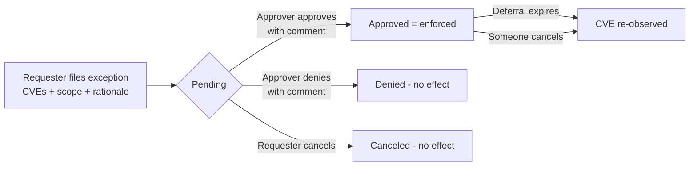

# Managing False Positives and Deferrals in RHACS

A practical guide to vulnerability exceptions in Red Hat Advanced Cluster
Security (RHACS): what a false positive is, when to defer instead, how the
approval workflow runs, and exactly what changes in RHACS once an exception is
approved.

Applies to RHACS 4.11.

---

## 1. The two exception types

### False positive

A **false positive** means: *the scanner reported this CVE, but the finding is
wrong. The vulnerability is not actually present in this image, and that will
not change.*

Typical reasons:

- The vulnerable code is not in the package build. Scanners match on package
  name and version, but the affected code may not be compiled in at all. This
  is the most common case for Red Hat images, and it is exactly what Red Hat's
  VEX security statements assert.
- The fix was backported, so the version number looks vulnerable but the patch
  is already in.
- The vulnerable code is in the image but can never be reached or triggered in
  this product. The weakest of the three; treat it as a false positive only
  when the vendor states it, since a code path that is unreachable today may
  become reachable after the next update.

A false positive is a **statement of fact**, not a decision to accept risk.
Because the fact does not expire, false positive exceptions in RHACS have
**no expiry date**. They stay active until someone cancels them.

### Deferral

A **deferral** means: *the CVE is real and affects us, but we accept the risk
for a limited time.*

Typical reasons:

- No fix exists yet; you will patch when one ships.
- A fix exists but the upgrade needs planning, and the risk is low enough to
  wait.
- The finding is noise for a workload being decommissioned next month.

A deferral is a **risk acceptance**, so it always carries an expiry:

| Expiry option | Meaning |
|---|---|
| Fixed date | Exception ends at a date you pick |
| When **any** CVE in the request becomes fixable | Ends as soon as a fix ships for one of the CVEs |
| When **all** CVEs become fixable | Ends when every CVE in the request has a fix |
| Indefinite | Never expires (only if the admin allows it) |

**Rule of thumb:** if the statement is "this was never exploitable here", file
a false positive. If it is "this is exploitable, we'll fix it later", file a
deferral. Never use a false positive to make a real vulnerability disappear:
it removes the CVE from every default view and policy, with no expiry to bring
it back.

---

## 2. The approval workflow

An exception is never applied by one person alone. It is a two-step,
maker-checker process:



Key facts:

- **A pending request changes nothing.** Enforcement starts only at approval.
- **A comment (rationale) is mandatory** on the request, on approval, and on
  denial. Everything is kept on the request as an audit trail.
- **Approving one request auto-denies overlapping pending requests** for the
  same CVEs and scope, with a system-generated comment naming the approved
  request.
- **Only one exception can exist per CVE + scope combination**, regardless of
  type.
- **Updates go back through approval.** Changing the expiry or CVE list of an
  approved exception creates a pending update; the original terms stay enforced
  until the update is approved.
- **Expiry is automatic.** Expired deferrals are closed by the system and their
  CVEs return to the Observed list.

### Who can do what

Two separate permissions make the four-eyes principle enforceable:

| Action | Permission (write) |
|---|---|
| Request, update, cancel an exception | `VulnerabilityManagementRequests` |
| Approve or deny an exception | `VulnerabilityManagementApprovals` |

Give requesters only the first and a security team only the second, and no
single person can both file and approve an exception.

### Scope

An exception applies to CVE(s) within an **image scope**:

| Scope | Meaning |
|---|---|
| One exact image tag | `registry/repository:tag` |
| Every tag of one repository | `registry/repository`, any tag |
| All images | Global: every current and future image |

In the web console the scope is fixed by where you open the request form:
global from the CVE list, image-only from an image page (details in
[section 3](#3-step-by-step-in-the-web-console)). The API lets you set any of
the three.

### Admin configuration

Under **Platform Configuration → System Configuration** (Exception
configuration) an admin chooses which expiry options requesters may pick: the
preset day counts (14/30/60/90 by default), whether custom dates are allowed,
whether the "until fixable" conditions are allowed, and whether indefinite
deferrals are allowed.

---

## 3. Step by step in the web console

### A. Requesting a deferral or false positive

**Decide the scope first.** You cannot pick it inside the form; it is fixed by
where you start:

| Exception should apply to | Start from |
|---|---|
| One image | The image's page (Path 1) |
| Every image, now and future | The CVE list (Path 2) |

> **Watch out:** the CVE list silently means *global*. A global false positive
> removes the CVE from every image, forever, no expiry. One image only? Path 1.

Both paths start at **Vulnerability Management → Results**, **Observed** tab.

#### Path 1: one image (the safe default)

1. **Images** toggle → click the image → **Vulnerabilities** tab.
2. Find the CVE, click the kebab menu (**⋮**) at the end of the row, choose
   **Defer CVE** or **Mark as false positive**. Several at once: checkboxes +
   **Bulk actions**.
3. Pick the scope: **Only `registry/repository:tag`** or
   **All tags within `registry/repository`**. Digest-deployed image (no tag):
   only **All tags** appears.

#### Path 2: global (all images)

1. Stay on the **CVEs** toggle.
2. Find the CVE, kebab menu (**⋮**) → **Defer CVE** or
   **Mark as false positive**. Several at once: checkboxes + **Bulk actions**.
3. Scope is fixed to **Selected CVEs across all images and deployments**.
   Not what you want? Cancel, use Path 1.

#### Finish (both paths)

- **Expiry** (deferrals only): 14/30/60/90 days, when any/all CVEs become
  fixable, a specific date, or indefinitely. Admin controls which options
  appear. False positives never expire.
- **Rationale**: required comment. Write the *why*; approvers and auditors
  read it.
- Submit. Nothing changes yet: the CVE stays in **Observed** until the request
  is approved. You can cancel your own request anytime.

### B. Approving or denying (second person)

1. Open **Vulnerability Management → Exception Management**. The page has four
   tabs: **Pending requests**, **Approved deferrals**,
   **Approved false positives**, **Denied requests**.
2. On **Pending requests**, click the request name. The details page shows the
   requester, type, scope, expiry, the full comment thread, and the list of
   requested CVEs.
3. Click **Approve request** or **Deny request**. Both ask for a comment, then
   confirm.
4. On approval the exception is enforced immediately: the CVEs move to the
   **Deferred** or **False positives** tab in Results, policy violations for
   them clear on the next detection cycle, and any overlapping pending requests
   are auto-denied. On denial nothing changes, because the CVEs were never
   affected.

You only see the actions your role allows: filing needs
`VulnerabilityManagementRequests` (write), the Approve/Deny buttons need
`VulnerabilityManagementApprovals` (write).

### C. Afterwards

- **Review what is excepted:** Exception Management → **Approved deferrals** /
  **Approved false positives**, or the **Deferred** / **False positives** tabs
  in Results. Both stay visible to auditors; nothing is deleted.
- **Change an approved exception:** open its request page and update it. The
  change appears back under **Pending requests**, and the original terms stay
  enforced until the update is approved.
- **Expiry:** expired deferrals return their CVEs to **Observed**
  automatically, with a system comment on the request. No notification is
  sent, so check the Observed tab after expiry dates.

---

## 4. What an approved exception changes in RHACS

Approval does two things. It changes the CVE's state from *observed* to
*deferred* or *false positive* on every image matching the scope. This is a
state change, not a deletion; the finding stays in the database. And it keeps
applying to the future: new images and new scans that match the scope get the
same treatment automatically. When scopes overlap, the most specific one wins:
exact tag beats repository-wide beats global.

From that state change flow the visible effects:

### Vulnerability Management views

The Results page has three tabs: **Observed**, **Deferred**, **False
positives**. An approved exception moves the CVE out of Observed into the
matching tab. Nothing is hidden from an auditor: the other tabs show exactly
what was excepted, and Exception Management keeps the full request history
with comments.

### Policies (the big one)

Every vulnerability-related policy criterion (**CVE**, **CVSS**, **NVD CVSS**,
**Severity**, **Fixable**, **Fixed By**) only evaluates *observed*
vulnerabilities. Consequences:

- A deferred or false-positive CVE **cannot trigger any vulnerability policy
  violation** at build time, deploy time, or runtime. A policy like "Fixable
  CVSS ≥ 7" simply no longer sees the CVE.
- This includes **admission control**: the enforcement points never even
  receive the excepted vulnerability.
- Existing violations disappear on the next detection cycle.
- Policy criteria that are **not** about vulnerabilities (image age, packages,
  process activity, and so on) are untouched.

### roxctl and CI

`roxctl image scan`, `roxctl image check`, and `roxctl deployment check` honor
approved exceptions automatically. The excepted CVEs are absent from the
output, so a CI gate built on roxctl follows the same decisions as the console.
`roxctl image scan --include-snoozed` brings them back if you need the full
picture.

### Risk

Deferred and false-positive CVEs no longer count toward image and deployment
risk scores, so excepted findings stop inflating your risk prioritization.

### What is NOT affected

- **The scan itself.** The scanner keeps finding the CVE; RHACS keeps storing
  it. An exception changes presentation and enforcement, never scan data.
- **Node and platform (cluster) CVEs.** The exception workflow covers workload
  (image) CVEs. Node and cluster CVEs have a separate, older snooze mechanism
  with no approval step.
- **Audit trail.** Every request, comment, approval, denial, and expiry is
  kept on the exception record.

---

## 5. Reports: exceptions and the new report configuration

### Old reports leak your exceptions

**Collection-based scheduled reports export everything, including deferred and
false-positive CVEs.** They only filter on fixability and severity; they have
no notion of vulnerability state. If your compliance flow assumes exceptions
are absent from those reports, that assumption is wrong.

RHACS is retiring this scope method. The report wizard itself warns that
collection-based reports will not be converted automatically, and recommends
moving to the new **Custom scope**.

This repository ships a migration helper,
[`examples/rhacs-report-migrate.sh`](../examples/rhacs-report-migrate.sh):
it lists collection-based report configurations, translates the collection
rules into a custom scope, always pins the report to **Vulnerability state =
Observed**, and detects platform reports (namespaces resolved against the
platform components configuration) to set the matching **Area of concern**
filter. The old configuration is left untouched for comparison.

### The new report configuration (4.11)

The wizard has five steps: **Details → Resources → Filters → Delivery →
Review**. Two things changed fundamentally:

**Custom scope (Resources step).** Collections are on their way out; new
reports should use a custom scope instead. On the Resources step, pick the
**Image type** (deployed and/or watched images), set **Scope method** to
**Custom scope**, and build the scope from rules:

- Rules target three resource types: **Cluster**, **Namespace**,
  **Deployment**.
- Each rule matches on **name**, **ID**, or **label** (namespaces and
  deployments also support **annotation**).
- Values match as **regex** by default; put the value in quotes for an exact
  match.
- Several values for the same field mean *any of them*; rules on different
  resource types combine, narrowing the scope (cluster AND namespace AND
  deployment).

Example: a per-team report scoped to `Cluster name "prod"` plus
`Namespace name ^team-a-.*` covers every current and future `team-a-*`
namespace in the prod cluster. No collection to create and maintain, and new
namespaces that match the pattern are picked up automatically.

**Vulnerability state (Filters step). This is the important one.** The report
now filters on the exception state of each CVE:

| State selected | The report contains | Use it for |
|---|---|---|
| **Observed** | Only active findings; exceptions excluded | Compliance reports, team work queues |
| **Deferred** | Only accepted-risk CVEs, with their expiry running | Risk register for management |
| **False positives** | Only CVEs ruled not present | Audit of what was written off |

New report configurations **default to Observed only**, so a freshly created
report finally matches what the Observed tab shows: your exceptions stay out.
Select several states if you want one combined report.

The Filters step also offers **Area of concern** (User workload / Platform /
Inactive, see below), **CVE severity**, **CVE status** (fixable), **CVEs
discovered in image since** (all time, since the last successful report, or a
custom start date), plus the free-form filter bar.

Exports from a view work the same way: the report inherits the filters of the
view it was exported from, including the state tab you were on.

### Area of concern: moving noise out of user workload reports

The **Area of concern** filter separates findings by responsibility:
**User workload** (your applications), **Platform** (OpenShift, operators,
infrastructure), **Inactive** (images not currently deployed).

What counts as "Platform" is configurable. Under
**Platform Configuration → System Configuration → Platform components
configuration → Custom components** you can add rules that classify extra
namespaces as platform. Each rule is a component name plus a namespace regex
(RE2 syntax; join several patterns with `|`).

Example: the OpenShift web terminal runs its pods in a namespace that is not
part of the built-in platform definition, so its CVEs land in every user
workload view and report. One custom rule fixes that:

| Field | Value |
|---|---|
| Component name | `web-terminal` |
| Namespace regex | `^openshift-terminal$` |

After the rule is saved, deployments in that namespace are reclassified: their
findings move from **User workloads** to **Platform** in the console and in any
report filtered by Area of concern.

Note this is *reclassification*, not an exception. The CVEs are still
observed, still drive policies and risk; they just stop polluting the
user-workload slice. Use platform classification for "not my team's problem",
and exceptions for "not a problem at all / accepted risk".

---

## 6. When the exception ends

- **Deferral expires** (date reached, or a fix ships for "until fixable"
  deferrals): the CVEs return to **Observed**. They reappear in views, in
  state-filtered reports, and, if a policy matches, as violations. There is
  no notification; watch the Observed tab or poll the API.
- **Cancel** or **delete**: same path, immediate.
- **Denied**: nothing to undo, because pending requests never had an effect.

---

## 7. Automating the workflow from the command line

This repository ships ready-made shell helpers:
[`examples/rhacs-exceptions.sh`](../examples/rhacs-exceptions.sh). Source the
file, set two environment variables, done:

```bash
source examples/rhacs-exceptions.sh

export ROX_ENDPOINT=central.example.com:443
export ROX_API_TOKEN=<requester token>      # VulnerabilityManagementRequests (write)
export ROX_APPROVER_TOKEN=<approver token>  # VulnerabilityManagementApprovals (write), optional
```

| Command | What it does |
|---|---|
| `rhacs-fp-request IMAGE CVE... -m "why"` | Request a false positive, scoped to the image |
| `rhacs-fp-request ... --auto-approve` | Same, approved immediately (token needs both permissions) |
| `rhacs-fp-list [pending\|approved\|denied]` | List requests as a table |
| `rhacs-fp-overview` | Counts per status plus pending detail |
| `rhacs-fp-approve ID -m "why"` | Approve one request |
| `rhacs-fp-approve-all` | Approve everything pending (asks first; `-y` to skip) |
| `rhacs-fp-cancel ID` | Revert an approved exception; its CVEs return to Observed |
| `rhacs-fp-cancel-all` | Revert every approved exception (test cleanup) |

Examples:

```bash
# Single CVE: httpd 2.4.50-1.el9 flagged for CVE-2023-25690,
# already fixed by the RHEL9 backport 2.4.53-7.el9_1.5
rhacs-fp-request quay.io/vuln/asset-cache:v1 CVE-2023-25690 \
    -m "False positive: fixed by RHEL9 backport httpd-2.4.53-7.el9_1.5, version match only"

# Several CVEs in one request, same image
rhacs-fp-request quay.io/vuln/asset-cache:v1 \
    CVE-2024-38474 CVE-2024-38475 CVE-2024-38476 CVE-2024-38477 \
    -m "False positives: httpd CVEs fixed by RHEL9 backports"

# Approver
rhacs-fp-list               # what is pending?
rhacs-fp-approve-all -m "verified batch against Red Hat VEX"
```

Behavior worth knowing:

- The image scope follows the rules from this document: a tagged reference
  becomes a `registry/repo:tag` scope; a digest reference becomes
  `registry/repo:.*` (all tags), because RHACS cannot scope by digest.
- CVEs already covered by an active request for the same scope are skipped
  automatically, so an approved exception is never touched by a new batch.
- TLS verification is skipped by default (lab friendly); set
  `ROX_CA_FILE=/path/ca.pem` to verify against Central's CA.

### Under the hood: the REST API

The helpers call the v2 API; use it directly for any other tooling. (The older
`/v1/cve/requests` endpoints still exist but are deprecated.)

| Action | Call |
|---|---|
| Request a deferral | `POST /v2/vulnerability-exceptions/deferral` |
| Request a false positive | `POST /v2/vulnerability-exceptions/false-positive` |
| List / poll | `GET /v2/vulnerability-exceptions?query=<filters>` |
| Approve | `POST /v2/vulnerability-exceptions/{id}/approve` |
| Deny | `POST /v2/vulnerability-exceptions/{id}/deny` |
| Update (re-enters approval) | `PATCH /v2/vulnerability-exceptions/{id}` |
| Cancel (revert enforcement) | `POST /v2/vulnerability-exceptions/{id}/cancel` |
| Delete (pending only) | `DELETE /v2/vulnerability-exceptions/{id}` |

The create payload looks like this:

```json
{
  "cves": ["CVE-2024-1234"],
  "comment": "Red Hat VEX: vulnerable code not present in this package build",
  "scope": {"imageScope": {"registry": "quay.io", "remote": "org/app", "tag": ".*"}}
}
```

Approved exceptions cannot be deleted, only canceled; canceled and expired
records are cleaned up automatically by the "Expired vulnerability requests"
retention setting (Platform Configuration → System Configuration, 90 days by
default).

---

## 8. Limitations to know about

These matter especially when mapping VEX decisions (which pin the exact image
content by digest) onto RHACS exceptions (which pin image *names*):

1. **No digest scope.** An exception cannot target `image@sha256:...`. The
   best you get is `registry/repository:tag`, and tags move: a rebuild pushed
   to the same tag changes the image content, but the exception silently keeps
   applying. Re-verify exceptions when the image behind a tag changes.
2. **No real wildcards in scopes.** Apart from the literal `.*` ("everything"),
   scope fields are matched as exact strings. A scope like `tag: "v1\..*"`
   will never match anything.
3. **Tagless images.** An image deployed by digest has no tag. It can only be
   covered by an all-tags or global scope, never pinned individually.
4. **One exception per CVE + scope.** Filing a deferral where a false positive
   already exists (same CVE, same scope) is rejected as already covered.

---

*Behavior in this document was verified against the RHACS source code and the
Red Hat Advanced Cluster Security 4.11 documentation, July 2026.*
